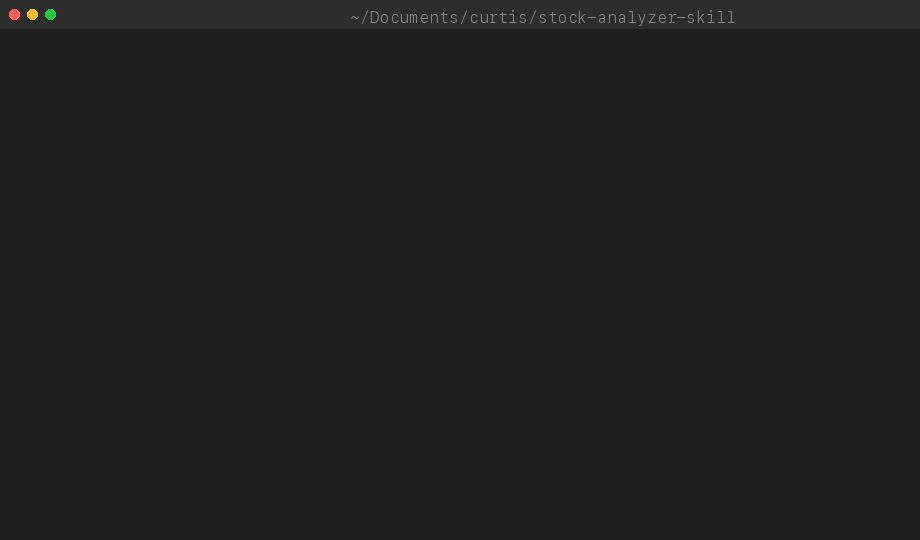
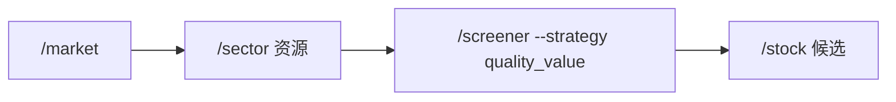
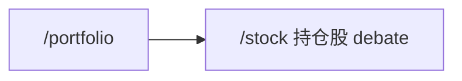
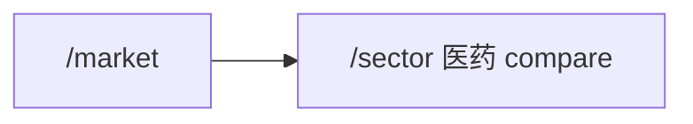
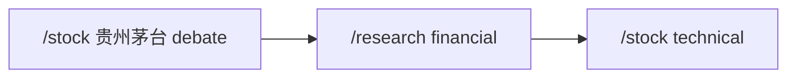
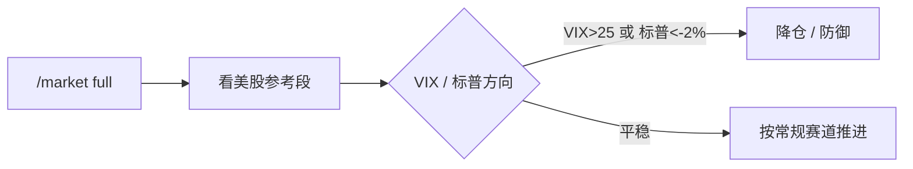

# stock-analyzer-skill

<div align="center">

```text
   ███████╗████████╗ ██████╗  ██████╗██╗  ██╗
   ██╔════╝╚══██╔══╝██╔═══██╗██╔════╝██║ ██╔╝
   ███████╗   ██║   ██║   ██║██║     █████╔╝
   ╚════██║   ██║   ██║   ██║██║     ██╔═██╗
   ███████║   ██║   ╚██████╔╝╚██████╗██║  ██╗
   ╚══════╝   ╚═╝    ╚═════╝  ╚═════╝╚═╝  ╚═╝
        A N A L Y Z E R   ·   S K I L L
```

## 🎯 给会写代码的投资者准备的 A 股分析套件

> 装进 Claude Code，对话框里打 `/stock 贵州茅台`，3 分钟拿到 5 层专业分析 + 8 人活跃专家圆桌（含 16 份专家人设）辩论。

**五层分析框架** · **16 份专家人设（8 active）** · **27 个数据源故障转移** · **零依赖开箱即用**

[](CHANGELOG.md)
[](pyproject.toml)
[](#-许可)
[](pyproject.toml)
[](#-13-个-skill-速查)

[🚀 快速开始](#-30-秒上手) · [🎬 看效果](#-效果一览) · [📖 文档导航](#-文档导航) · [💬 常见问题](#-常见问题)

</div>

---

## 📑 目录

- [✨ 这是什么？](#-这是什么)
- [🎯 核心能力](#-核心能力)
- [🚀 30 秒上手](#-30-秒上手)
- [❓ 4 个常见问题 → 4 条命令](#-4-个常见问题--4-条命令)
- [🎬 效果一览](#-效果一览)
- [👥 16 份专家人设（招牌功能）](#-16-份专家人设招牌功能)
- [🗺️ 5 个典型场景](#-5-个典型场景)
- [📋 13 个 Skill 速查](#-13-个-skill-速查)
- [📦 安装方式](#-安装方式)
- [🏗️ 项目架构](#-项目架构)
- [📖 文档导航](#-文档导航)
- [💬 常见问题](#-常见问题)
- [⚠️ 已知限制](#-已知限制)
- [🤝 贡献与反馈](#贡献与反馈)
- [📜 许可](#许可)

---

## ✨ 这是什么？

> 🎯 **一句话**：把它装进 Claude Code，用对话的方式做 A 股投资研究——不写代码、零配置、9 条命令覆盖选股 / 看盘 / 看持仓 / 研究 / 监控 / 回测 / 学习。

一个把 **A 股专业分析能力** 封装成 9 条 `/xxx` 斜杠命令的 Claude Code 插件包。

> 💡 不写代码也能用——**说一句 `/stock 贵州茅台`，3 分钟拿到 5 层专业分析**。

<table>
<tr>
<th width="50%">✅ 适合你，如果你是……</th>
<th width="50%">❌ 不适合你，如果你想要……</th>
</tr>
<tr>
<td valign="top">

📈 **散户 / 个人投资者**
日常看行情、复盘、盯持仓

🎓 **投资学习者**
跟 8 位投资专家的人设理解多空博弈

🛠 **量化爱好者 / 工程师**
二次开发、组合到自己的工作流

</td>
<td valign="top">

🤖 **代码选股圣杯**
本包不保证收益，不替你下单

⚡ **HFT / Tick 级行情**
数据源最小粒度为分钟级

💰 **付费订阅推票**
本包是研究框架，非荐股服务

</td>
</tr>
</table>

---

## 🎯 核心能力

<table>
<tr>
<td width="33%" align="center" valign="top">

### 🔍 五层分析框架

**基本面** · **估值**
**技术面** · **板块**
**风险收益比**

每层都有量化打分<br>
默认输出可解释结论

</td>
<td width="33%" align="center" valign="top">

### 👥 16 份专家人设

**长线 5 人（active）**<br>
林奇 · 索罗斯 · 价值机构锚<br>
行业专家 · 风控

**短线 3 人（active）**<br>
题材龙头 · 情绪技术复合 · 动量派

**8 人（legacy，已合并入 active）**<br>
巴菲特 · 段永平 · 价值锚 · 机构派<br>
徐翔 · 赵老哥 · 养家 · 作手新一

</td>
<td width="33%" align="center" valign="top">

### 🔁 多源故障转移

**27 个 fetcher 模块（35 类）**<br>
腾讯 · 东财 · 新浪<br>
雪球 · 同花顺 · 通达信<br>
AkShare · efinance · yfinance<br>

集成熔断器，单源故障<br>自动切换下家

</td>
</tr>
</table>

---

## 🚀 30 秒上手

> ⚠️ **风险提示**：所有分析仅供参考，不构成投资建议。投资有风险，决策需谨慎。

**先决条件**：需要先装 [Claude Code](https://claude.com/download)（约 2 分钟），终端输入 `claude --version` 看到版本号就 OK。

```bash
# 1️⃣ 克隆项目并安装（约 30 秒）
git clone <repo> && cd stock-analyzer-skill && ./install.sh

# 2️⃣ 初始化股票池（仅首次；网络差用 default 走预置数据）
/screener init default

# 3️⃣ 开跑（3 分钟拿到 5 层分析）
/stock sh600519 quick
```

> **零配置可用**：内置预置默认股票池，无 token 即可启动。联网时自动获取最新数据，失败自动 fallback。

<details>
<summary>其他安装方式（npm）</summary>

```bash
# npm 全局（自动运行 install.sh）
npm install -g stock-analyzer-skill
```

</details>

### 🎬 30 秒命令演示（C7）

不想安装？直接看 10 条命令走完核心流程：

```bash
# 完整可重放脚本：bash scripts/demo.sh
$ python3 scripts/init_pool.py --default                       # 1. 初始化股票池
$ python3 scripts/screener.py --strategy balanced --top 5    # 2. 选股
$ python3 scripts/stock.py sh600519 quick                    # 3. 单股快评
$ python3 scripts/backtest.py --all --benchmark sh000300     # 4. 6 策略回测对比
$ python3 scripts/backtest.py --optimize --strategy growth_momentum  # 5. 权重优化
$ python3 scripts/strategy_performance.py record --days 30   # 6. 月度校准
$ python3 scripts/strategy_performance.py compare            # 7. 跨策略对比
$ python3 scripts/screener.py --snapshot --two-stage         # 8. 两阶段管线 + 快照
$ python3 scripts/snapshots.py list                          # 9. 列出快照
$ python3 scripts/strategy_performance.py report              # 10. 月度报告
```

> 完整脚本：[`scripts/demo.sh`](scripts/demo.sh) · 9 个 GIF 演示：[docs/assets/](docs/assets/)

## 🆕 v1.8.0 新增能力

| 新能力                    | 怎么用                                                                         | 价值                                                 |
| ------------------------- | ------------------------------------------------------------------------------ | ---------------------------------------------------- |
| 🎮 **模拟盘（虚拟持仓）** | `/portfolio add sh600989 1000 18.50 --virtual` 或 `portfolio_web.py --virtual` | 零风险练习交易策略，虚拟/实盘数据完全隔离            |
| 📅 **事件日历**           | `python3 scripts/events.py sh600519`                                           | 财报披露、限售解禁、分红一目了然，避免踩雷           |
| 📋 **统一输出模板**       | 13 个 skill 自动生效——首行结论 + 尾行数据源 + 时间戳                           | 格式一致可复盘，每次输出都带数据来源和时间           |
| 🔄 **校准数据同步**       | `python3 scripts/calibration_sync.py --auto`（依赖 gh CLI）                    | 跨设备同步专家校准数据，GitHub Gist 双向同步         |
| 🏆 **专家胜率卡片**       | `/stock sh600519 debate` 自动附加                                              | 辩论报告尾部显示每位专家历史胜率，可信度透明         |
| 📊 **回测胜率附加**       | `/stock sh600519 --with-backtest`                                              | 分析报告附加近 60 日回测（胜率/收益/夏普/回撤）      |
| 📝 **结构化 JSON 日志**   | `monitor --log-json` / `monitor --sources`                                     | 监控输出机器可解析，数据源健康度矩阵一目了然         |
| 📚 **mdBook 文档站**      | GitHub Pages 自动部署，含 [完整演练教程](docs/tutorials/walkthrough-600519.md) | 新人友好：搜索 + 章节导航 + 13 skill 串联实战        |
| 🛡️ **自审计 CI**          | 提交 PR 自动运行                                                               | SKILL.md 与 settings.json 一致性自动检查，阻断不一致 |
| 🎯 **场景化帮助**         | `/stock-help`                                                                  | 5 个场景入口（找机会/看大盘/看持仓/深度研究/看板块） |

<details>
<summary>📦 <b>v1.7.0 能力（折叠）</b></summary>

| 新能力                              | 怎么用                                                                                               | 价值                                             |
| ----------------------------------- | ---------------------------------------------------------------------------------------------------- | ------------------------------------------------ |
| 🎯 **专家圆桌决策引擎**             | `/stock sh600989 debate` 自动跑 8 位专家 → 加权投票 → 方向 + 信心 + 仓位                             | 把"LLM 推理的模糊判断"转成"可解释、可复盘的决策" |
| 🧠 **专家自校准**                   | debate 完成后自动写 `data/expert_calibration.json`，下轮信心指数自动校准                             | 用历史准确率反推"该不该信这一次"                 |
| 🌎 **美股参考板块**                 | `/market full` 自动拉 `us:^gspc` / `us:^ixic` / `us:spy` 等收盘数据（**需 `pip install yfinance`**） | 隔夜美股 + VIX 提前一天判断 A 股开盘情绪         |
| 📈 **全市场股票池（~5000 只）**     | `/screener init full-market` 一次性拉全 A 股，按板块预筛后进 screener                                | 真正"全市场扫描"，不再被默认 20 只限死           |
| 🛰️ **通达信局域网数据源（v1.7.1）** | `pip install pytdx` + 本地通达信客户端开启 7709 端口后，行情/K 线自动走 pytdx（优先级 9）            | 局域网直连，速度快、无限频，适合盘中频繁查询     |

</details>

> 📖 详细使用方法见 [docs/user-guide.md](docs/user-guide.md) 与 [CHANGELOG.md](CHANGELOG.md)。

<details>
<summary>📱 <b>嫌 CLI 麻烦？打开本地 Web 录入</b></summary>

```bash
python3 scripts/portfolio_web.py
# 浏览器打开 http://127.0.0.1:8765/
```

手机/电脑都能用，支持 IFTTT 等 Webhook 推送持仓变更。详见 `/portfolio` skill 的「Web 录入（可选）」段。

</details>

---

## 🎬 效果一览

<details open>
<summary><b>📊 单股五层分析示例</b> — <code>/stock 贵州茅台 quick</code></summary>



```text
🏢 贵州茅台 (sh600519) · 白酒龙头
─────────────────────────────────────
💰 现价 ¥1,652.30   📈 +0.85%   💎 PE 22.1   📊 PB 6.8

【第 1 层 · 基本面】 ⭐⭐⭐⭐  评分 85/100
  ROE 31.2%（行业 Top 1）│ 毛利率 91.5% │ 净利率 53.6%
  ✅ 业绩持续 5 年正增长，现金流充沛

【第 2 层 · 估值】 ⭐⭐⭐⭐  评分 78/100
  PE 22.1 vs 历史中位 28 │ 处于近 5 年 23% 分位
  ✅ 当前估值偏低，安全边际充足

【第 3 层 · 技术面】 ⭐⭐⭐  评分 65/100
  MA20 上行 │ MACD 金叉初现 │ KDJ 超买
  ⚠️ 短期回踩 1620 概率较大

【第 4 层 · 板块】 ⭐⭐⭐⭐  评分 80/100
  白酒板块近 30 日资金净流入 38 亿，强于大盘

【第 5 层 · 风险收益比】 1 : 3.2 ⭐⭐⭐⭐
  目标价 ¥1,950（+18%）│ 止损 ¥1,560（-5.6%）

🎯 综合结论：可分批介入，回踩 1620 加仓
```

</details>

<details>
<summary><b>👥 16 份专家人设圆桌示例</b> — <code>/stock 贵州茅台 debate</code></summary>


```text
🎤 16 份专家人设圆桌 · 贵州茅台 (sh600519)
═══════════════════════════════════════

【长线阵营】
🟢 巴菲特    8.5/10  "31% ROE + 永续护城河，长期可持有"
🟢 林奇      7.5/10  "PEG 0.8，增长消化估值，buy"
🟡 索罗斯    6.0/10  "趋势中性，等待量能确认"
🟢 段永平    9.0/10  "本就该买，跌了更买"

【短线阵营】
🟡 徐翔      5.5/10  "无明显涨停基因，非首选"
🔴 赵老哥    4.0/10  "趋势钝化，不在我射程"
🟡 养家      6.0/10  "情绪温和，板块二线"
🟢 作手新一  7.5/10  "回踩 1620 是教科书低吸点"

─────────────────────────────────────
🗳️ 最终投票：4 买入 · 3 观望 · 1 回避
🎯 综合建议：长线优配 / 短线观望 → 见 decide.md 详解
```

</details>

<details>
<summary><b>📈 大盘复盘示例</b> — <code>/market</code></summary>


```text
📅 2026-06-11 收盘复盘
─────────────────────────────────────
上证 3,142 (+0.32%)  深成 10,856 (+0.58%)  创业 2,234 (+1.12%)

【风格】成长 > 价值 │ 小盘 > 大盘 │ 进攻信号 🟢
【板块 Top3】AI 算力 +3.8% / 半导体 +2.4% / 新能源车 +1.9%
【板块 Bot3】白酒 -1.2% / 银行 -0.8% / 地产 -0.6%

【主力资金】净流入 87 亿（连续 3 日）
【北向资金】净买入 23 亿
【两融余额】1.62 万亿（环比 +1.2%）

🎯 策略：进攻型仓位可提升至 70%，重点关注算力/半导体补涨
```

</details>

---

## 👥 16 份专家人设（招牌功能）

> 🌟 **本包最独特的卖点**。16 份投资专家人设（8 active + 8 legacy）从各自框架独立打分，由 [`decide.md`](experts/decide.md) 汇总投票。8 位 legacy 专家已合并入 active 专家视角（value_institution/topic_leader/emotion_tech），active 8 人 = 5 长 + 3 短。

<table>
<tr>
<th colspan="2" align="center">🟢 长线 4 人（价值发现）</th>
<th colspan="2" align="center">🔴 短线 4 人（时机把握）</th>
</tr>
<tr>
<td align="center">

**[巴菲特](experts/buffett.md)**
价值投资<br>
高 ROE + 低 PE

</td>
<td align="center">

**[彼得·林奇](experts/lynch.md)**
成长投资<br>
PEG &lt; 1

</td>
<td align="center">

**[徐翔](experts/xu_xiang.md)**
涨停板战法<br>
龙头 + 量价

</td>
<td align="center">

**[赵老哥](experts/zhao_laoge.md)**
趋势龙头<br>
波段操作

</td>
</tr>
<tr>
<td align="center">

**[索罗斯](experts/soros.md)**
宏观趋势<br>
反身性 + 技术

</td>
<td align="center">

**[段永平](experts/duan_yongping.md)**
逆向投资<br>
低估值 + 护城河

</td>
<td align="center">

**[炒股养家](experts/chaogu_yangjia.md)**
情绪流<br>
情绪周期判断

</td>
<td align="center">

**[作手新一](experts/zuoshou_xinyi.md)**
强势股低吸<br>
回调支撑分批

</td>
</tr>
</table>

📖 每位专家含 1200+ 字深度档：核心哲学 / 量化选股标准 / 买卖规则 / 仓位止损 / A 股适用边界 / 代表案例 — 详见 [experts/README.md](experts/README.md)。

---

## ❓ 4 个常见问题 → 4 条命令

不知道从哪开始？挑一个最贴近你的问题：

| 你的问题            | 一句话命令        | 你会得到什么                                         |
| ------------------- | ----------------- | ---------------------------------------------------- |
| 🔍 帮我分析一只股票 | `/stock sh600519` | 5 层分析（基本面 / 估值 / 技术 / 板块 / 风险收益比） |
| 📊 今天大盘怎么样   | `/market quick`   | 三大指数 + 板块 Top3 + 一句话策略                    |
| 💼 我的持仓怎么样   | `/portfolio`      | 涨跌 + 板块集中度 + 风险预警 + 调仓建议              |
| 🤔 不知道买什么     | `/screener`       | 6 种策略 × 9 因子筛选 → 10 只候选 + 跟踪清单         |

> 💡 不写代码、零配置可用。30 秒完成 `/screener init` 初始化股票池，3 分钟跑通 `/stock sh600519 quick`。

---

## 🗺️ 5 个典型场景

不知道从哪个命令开始？挑一个最贴近你当前问题的：

### 1️⃣ 自上而下选股



**适合**：节奏感强、想从市场状态推导出具体标的的投资者
**产出**：从大盘风格 → 板块强弱 → 5 因子筛选 → 个股决策的完整链条

### 2️⃣ 诊断现有持仓



**适合**：持仓 3-10 只、想确认风险敞口与调仓方向
**产出**：仓位健康度 + 板块集中度 + 风险预警 + 多空辩论结论

### 3️⃣ 挖掘板块机会



**适合**：行业研究员、主题轮动交易者
**产出**：板块轮动位置 + 核心标的横向对比 + 资金偏好

### 4️⃣ 深度研究单股



**适合**：单笔仓位重、需要决策依据存档的投资者
**产出**：8 方观点 + 财务建模 + 技术买卖点的完整研究包

### 5️⃣ 🌎 隔夜美股 → A 股开盘情绪（v1.7.0）



**适合**：每日开盘前 30 分钟做情绪判断的投资者
**产出**：美股收盘 + VIX + 对 A 股传导路径的预判，避免隔夜黑天鹅被闷杀

> 💡 13 个 skill 完整衔接流程见 [`workflow.md`](workflow.md)。

---

## 📋 13 个 Skill 速查

> 🎯 **一句话**：stock 决策 / market 环境 / sector 板块 / screener 选股 / portfolio 组合 / monitor 监控 / backtest 验证 / research 研究 / stock-help 帮助；含 4 个变体 stock-technical / portfolio-web / portfolio-natural / learn。

| 类别        | Skill                                                  | 命令                                             | 一句话价值                                   |
| :---------- | :----------------------------------------------------- | :----------------------------------------------- | :------------------------------------------- |
| 🎯 **决策** | [stock](skills/stock/SKILL.md)                         | `/stock <代码> [quick\|full\|debate\|technical]` | 单股五层分析 · 16 份专家圆桌辩论 · 纯技术面  |
| 🎯 **决策** | [stock-technical](skills/stock-technical/SKILL.md)     | `/stock-technical <代码>`                        | 纯技术面（均线/MACD/KDJ/BOLL/RSI/缠论/战法） |
| 🌐 **环境** | [market](skills/market/SKILL.md)                       | `/market [full\|quick\|intraday]`                | 大盘快评 / 完整复盘 / 盘中分时               |
| 🌐 **环境** | [sector](skills/sector/SKILL.md)                       | `/sector <板块> [overview\|compare\|stock]`      | 板块全景 / 标的对比 / 板块内筛选             |
| 🔎 **选股** | [screener](skills/screener/SKILL.md)                   | `/screener [--strategy 策略] [init]`             | 6 种策略 × 9 因子维度批量选股 + 股票池初始化 |
| 💼 **组合** | [portfolio](skills/portfolio/SKILL.md)                 | `/portfolio [health\|rebalance\|compare]`        | 持仓健康 / 调仓再平衡 / 模拟盘 / 标的对比    |
| 💼 **组合** | [portfolio-web](skills/portfolio-web/SKILL.md)         | `/portfolio web [--port 8765]`                   | Web 录入服务（HTTP API :8765）               |
| 💼 **组合** | [portfolio-natural](skills/portfolio-natural/SKILL.md) | 自然语言持仓操作                                 | NL → 命令映射（我买了/减仓/破位止损）        |
| 📡 **监控** | [monitor](skills/monitor/SKILL.md)                     | `/monitor [scan\|levels\|check]`                 | 盘中异动 + 策略关键点位 + Bark/企微/钉钉推送 |
| 🧪 **验证** | [backtest](skills/backtest/SKILL.md)                   | `/backtest [--strategy 策略] [--all]`            | 策略历史回测，含卡玛比率/盈亏比/夏普         |
| 🔬 **研究** | [research](skills/research/SKILL.md)                   | `/research [financial\|report] <任务>`           | 深度研究：财务建模 / 排雷 / DCF / 估值       |
| 📚 **学习** | [learn](skills/learn/SKILL.md)                         | `/learn <概念>`                                  | 学习助手：PE/ROE/MACD/K 线/缠论/新手入门     |
| ❓ **辅助** | [stock-help](skills/stock-help/SKILL.md)               | `/stock-help`                                    | 显示所有 skills 和使用说明                   |

> 📌 **已合并命令**：`/help` → `/stock-help`、`/technical` → `/stock technical`、`/stock-init` → `/screener init`、`/financial-analyst` → `/research financial`、`/investment-researcher` → `/research report`（旧命令仍可用，自动跳转）

> 📌 **股票代码格式**：`sh600519`（沪） / `sz000858`（深） / `600519`（自动推断） / `贵州茅台`（按名称模糊匹配）— **用代码最稳**，名称匹配在多个相似名时可能错配。

---

## 📦 安装方式

<table>
<tr>
<th width="33%">⭐ 推荐方式</th>
<th width="33%">📦 npm 全局</th>
</tr>
<tr>
<td valign="top">

**git clone + install.sh**

```bash
git clone <repo> && cd stock-analyzer-skill
./install.sh
```

✅ 自动软链到 ~/.claude/skills/<br>
✅ 支持 Claude Code + Codex

</td>
<td valign="top">

**npm**

```bash
npm install -g \
  stock-analyzer-skill
```

✅ 跨项目复用<br>
✅ 升级方便

</td>
<td valign="top">

**Symlink（传统）**

```bash
git clone <repo>
cd stock-analyzer-skill
./install.sh
```

⚠️ 需重启 Claude Code

</td>
</tr>
</table>

### ✅ 验证安装

```bash
claude skills list | grep stock     # 看到 13 个 skill 即成功
/stock-help                          # 在 Claude Code 内查看命令清单
```

---

## 🏗️ 项目架构

```text
scripts/
├── business/      # 业务逻辑层（stock_analysis / screening_service）
├── common/        # 基础设施（HTTP、缓存、熔断器、异常体系）
├── config/        # 外部化配置（YAML：评分 / 数据源 / 行业阈值）
├── data/          # 数据类型 + 磁盘缓存 + 股票池
├── fetchers/      # 27 个数据源适配器（腾讯/东财/新浪/雪球/同花顺/AkShare/efinance/pytdx/...）
├── strategies/    # 6 种选股策略 + 因子库
├── technical/     # 技术指标（MACD/KDJ/BOLL/RSI/均线/缠论/本土战法）
├── monitor/       # 实时监控 + 多通道通知
├── portfolio/     # 持仓管理
└── *.py           # 顶层 CLI 入口（SKILL.md 直接调用）
```

### 💎 核心特性

| 特性                      | 说明                                      |
| :------------------------ | :---------------------------------------- |
| 🪶 **零 Python 外部依赖** | 仅 `urllib` + `json` + `pathlib` + `yaml` |
| 🔁 **多数据源故障转移**   | 单 API 挂掉自动切下家（集成熔断器）       |
| 🏛️ **三层架构**           | API 层 → 业务层 → 数据层，职责清晰易扩展  |
| ⚙️ **配置外部化**         | 行业阈值 / 评分权重 / 数据端点全部 YAML   |
| 🧪 **测试覆盖**           | 单元测试 + 元数据测试 + 端到端冒烟测试    |

📖 详见 [开发者指南](docs/developer-guide.md) 和 [产品架构](docs/product-architecture.md)。

---

## 📖 文档导航

<table>
<tr>
<th>你的角色</th>
<th>推荐先读</th>
<th>之后</th>
</tr>
<tr>
<td>🆕 <b>新用户</b></td>
<td><a href="docs/quick-start.md">快速入门</a></td>
<td><a href="docs/user-guide.md">使用者指南</a></td>
</tr>
<tr>
<td>📈 <b>投资者</b></td>
<td><a href="methodology.md">投资方法论</a></td>
<td><a href="experts/README.md">16 份专家档案库（8 active + 8 legacy）</a></td>
</tr>
<tr>
<td>🛠️ <b>二次开发者</b></td>
<td><a href="docs/developer-guide.md">开发者指南</a></td>
<td><a href="docs/api-reference.md">API 参考</a></td>
</tr>
<tr>
<td>🤝 <b>贡献者</b></td>
<td><a href="CONTRIBUTING.md">贡献指南</a></td>
<td><a href="CHANGELOG.md">变更日志</a></td>
</tr>
<tr>
<td>📐 <b>审查视角</b></td>
<td><a href="docs/persona.md">用户画像</a></td>
<td><a href="docs/user_expert.md">用户专家</a> · <a href="docs/visual_expert.md">视觉专家</a></td>
</tr>
</table>

---

## 💬 常见问题

<details>
<summary><b>Q：股票池没初始化会怎样？</b></summary>

使用 `/stock`、`/screener`、`/sector` 时如果股票池未初始化，系统会自动触发或提示先跑 `/screener init`。

</details>

<details>
<summary><b>Q：可以离线使用吗？</b></summary>

可以。`/screener init default` 走预置数据，零网络请求。联网后再 `/screener init force` 刷新。

</details>

<details>
<summary><b>Q：数据源挂了怎么办？</b></summary>

内置熔断器 + 多源故障转移：腾讯 → 东财 → 新浪 → 雪球 → 同花顺 → AkShare → efinance → ……，单源失败不影响整体。

</details>

<details>
<summary><b>Q：分析结果能直接拿去交易吗？</b></summary>

❌ **不能**。所有输出仅供研究框架参考，**不构成投资建议**。投资有风险，决策需谨慎。

</details>

<details>
<summary><b>Q：如何自定义持仓？</b></summary>

```bash
cp scripts/data/portfolio_example.json scripts/data/portfolio.json
# 编辑 portfolio.json 的 codes 字段
/portfolio    # 自动读取 portfolio.json
```

或使用零依赖 Web 录入：`python3 scripts/portfolio_web.py`，浏览器打开 `127.0.0.1:8765`。

</details>

<details>
<summary><b>Q：16 份专家投票冲突时怎么办？</b></summary>

由 [`experts/decide.md`](experts/decide.md) 定义的整合规则裁决——加权投票 + 长短线分仓建议。例如长线偏多、短线偏空，结论会是「核心仓持有、卫星仓减仓」。

</details>

<details>
<summary><b>Q：缓存越来越大怎么办？</b></summary>

运行缓存清理命令可删除过期缓存（默认 6 小时 TTL）：

```bash
python3 scripts/monitor.py --cleanup
```

建议配合 cron 每日自动清理（以 macOS/Linux 为例）：

```bash
# 每天凌晨 3 点清理过期缓存
0 3 * * * cd /path/to/stock-analyzer-skill && python3 scripts/monitor.py --cleanup
```

查看缓存状态：`python3 scripts/monitor.py --cache`

</details>

---

## ⚠️ 已知限制

- 实时数据依赖外部 API 稳定性，端点变更时改 `scripts/fetchers/` 即可
- 预置股票池为静态快照，全市场最新数据需联网刷新
- 多因子权重基于经验设定，回测模块（v1.5.0+）支持卡玛/盈亏比/夏普等 11 项指标验证，但未做大规模参数寻优
- 回测财务数据存在前瞻偏差防护：quality 因子按 report_date + 90 天披露延迟过滤，仅使用交易日已公开披露的财报（P0-10）。valuation/liquidity 因子基于历史 K 线价格，严格无前瞻
- 资金面数据（融资融券 / 股东户数）每日更新，受交易所披露节奏限制
- 美股数据依赖 `yfinance` 包（可选），未安装时自动跳过
- 校准数据同步依赖 `gh` CLI，未配置 GitHub 认证时 `--auto` 模式不可用

---

## 🤝 贡献与反馈

提交规范详见 [CONTRIBUTING.md](CONTRIBUTING.md)。
Issue / PR / 建议 → [GitHub Repo](https://github.com/CurtisTong/stock-analyzer-skill)。

### 发版流程

```bash
# 1. bump 版本
python3 scripts/dev/sync_version.py --version 1.14.1

# 2. 同步测试常量（关键！防止 release CI 阻塞）
python3 scripts/dev/sync_skill_test_versions.py

# 3. 验证
python3 scripts/dev/sync_skill_test_versions.py --check

# 4. 提交 + 打 tag + push
git add -A
git commit -m "chore(release): 同步至 v1.14.1"
git tag -a v1.14.1 -m "Release v1.14.1"
git push origin main --tags
```

> ⚠️ `sync_skill_test_versions.py` 也会被 pre-commit hook 和 release CI 自动调用，
> 但本地手动跑一次能更早发现问题。

---

## 📜 许可

MIT License © curtis

<div align="center">

---

**v1.15.0** · 2026-07-09 · 最后更新见 [CHANGELOG.md](CHANGELOG.md)

⭐ 觉得有用？Star 一下 [GitHub Repo](https://github.com/CurtisTong/stock-analyzer-skill) 是最好的支持！

</div>
