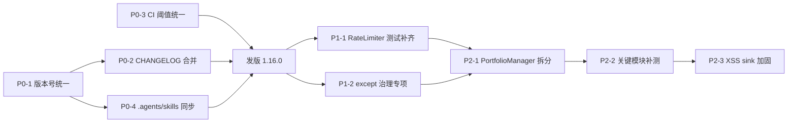

# 项目深度审查报告（2026-07-28）

> 范围：v1.16.0 分支状态（含未提交 PR 漂移）
> 方法：两轮并行 Explore 子智能体全量扫描 + 关键文件直接核对
> 重点：构建/CI/版本一致性 + WP5/WP6 重构回归风险 + 错误处理 + 可维护性
>
> **本报告不动代码**——仅记录问题、证据与建议修复方案，待后续 PR 实施。
>
> 关联文档：[review-issues.md](review-issues.md)（2026-07-09 75 项问题清单）· [architecture-review-2026-07-07.md](architecture-review-2026-07-07.md)（46 项架构债）· [improvement-roadmap.md](improvement-roadmap.md)

---

## 一、摘要与评分卡

| 维度 | 评分 | 关键信号 |
|:---|:---:|:---|
| 测试规模 | 🟢 强 | 33 个测试文件，~589 个 `def test_`，8887 LOC，分层（unit/integration/e2e/contracts/helpers） |
| 类型提示 | 🟡 弱 | `mypy.ini` 仅 `common.*` 严格；其余模块全局禁用 `no-untyped-def` / `no-any-return` |
| 异常处理 | 🔴 风险 | 24 处 `except Exception:`，其中 ~11 处 HIGH/MEDIUM 风险（吞错后返回默认值或 `pass`） |
| 文档质量 | 🟢 强 | README 29KB、CLAUDE.md 14KB、docs/ 35 文件、methodology.md 38KB |
| 版本一致性 | 🔴 P0 漂移 | `pyproject.toml=1.16.0`，其余全部 `1.15.0`；`.agents/skills/{monitor,portfolio}/SKILL.md=1.14.1` |
| CI 配置一致性 | 🔴 P0 漂移 | `.coveragerc=60`，`ci.yml=21`，`release.yml=60`——三处阈值不一致 |
| CHANGELOG 治理 | 🔴 P0 漂移 | 40 个堆叠 `[Unreleased]` 区块（`gen_changelog.py` 从不合并） |
| WP5/WP6 回归 | 🟡 风险 | WP5 RateLimiter 关键路径无测试；WP6 `board_overrides` YAML 实际为空 |
| 大文件/重构债 | 🟡 中 | 19 个 >500 LOC 生产文件；`PortfolioManager` 是 41 方法的 god class |
| 安全姿态 | 🟢 整体稳 | portfolio web 有 token 鉴权 + origin allowlist + 速率限制；存在 1 处 innerHTML+TOKEN 拼接 sink（当前因 token 由 server 生成故安全） |
| 配置/构建 | 🟢 强 | pre-commit + 4 个本地 hook + 黑/ruff/mypy + sync_version + contracts 校验 |
| 凭据/密钥 | 🟢 LOW 风险 | 0 处硬编码密钥；13 个被消费的 env 变量未声明在 `.env.example`；2 处 eastmoney ut token 字符串拼接嵌入 URL |
| 依赖治理 | 🟡 MEDIUM | 缺 `[project.dependencies]` 段（运行时依赖未声明）；缺 lockfile；`respx` 声明但 venv + CI 均缺失；black/ruff pre-commit 与 CI 版本漂移 |
| 类型提示覆盖 | 🟡 LOW 风险 | mypy 仅对 6 个白名单文件 + `common.*` 严格执行；`strategies/patterns/*`、`technical/{macd,kdj,boll,rsi,...}.py` 等 0% 类型注解 |
| pre-commit 完备性 | 🟡 MEDIUM | 5 项 CI 检查（mypy / sync_version / check_allowed_tools / validate_contracts / validate_input）无 pre-commit 对应；black/ruff 版本漂移 |
| TODO / FIXME 治理 | 🟢 良好 | 仅 11 个 TODO、3 个 production code TODO 全部 backlog-tagged；0 个 FIXME/HACK/XXX/BUG；backlog ID 覆盖率强 |

**核心结论**：项目主体质量扎实（测试/文档/构建工具齐备），但 v1.16.0 重构期间（commit `68f9e83`）出现了一次**单文件版本号越权**（仅 `pyproject.toml` 改动），加上 `gen_changelog.py` 的合并缺陷与 CI 阈值被刻意下调未被同步，构成了当前 4 项 P0 构建/CI/版本治理问题。WP5/WP6 在两周内被合并进主干但缺乏端到端测试覆盖，是当前最大的业务正确性风险来源。补充 5 项维度（凭据/依赖/类型/pre-commit/TODO）审计发现：**依赖治理是次级 P0 风险**（缺 lockfile + CI install gap），**pre-commit 完备性是 P1**（5 项 CI 检查无本地 hook 对应），其余三维度（凭据/类型/TODO）整体处于低位但有可治理点。

---

## 二、P0：构建/CI/版本（4 项）

### P0-1 版本号漂移 — `pyproject.toml` 领先其余文件 1 个版本

**症状**：项目对外标识两个版本号。`pyproject.toml` 声明 v1.16.0，但 `package.json`、`.claude-plugin/plugin.json`、`.claude-plugin/marketplace.json`、13 个 `skills/*/SKILL.md`、README badge 全部声明 v1.15.0；CHANGELOG 最新发布条目为 v1.15.0（2026-07-09）。

**证据**：

| 文件 | 行 | 版本 |
|:---|:---:|:---|
| `pyproject.toml` | 3 | `1.16.0` |
| `package.json` | 3 | `1.15.0` |
| `.claude-plugin/plugin.json` | 4 | `1.15.0` |
| `.claude-plugin/marketplace.json` | 4, 13 | `1.15.0`（×2） |
| 13 个 `skills/*/SKILL.md` | frontmatter | `1.15.0` |
| `README.md` | badge 区域 | `1.15.0` |
| `CHANGELOG.md` | 最新发布条目 | `1.15.0` (2026-07-09) |

**根因**：

- 单 commit `68f9e83` (2026-07-20, "refactor(tests): 重构测试框架") 仅修改了 `pyproject.toml` 一行的 version 字段，从 `1.15.0` 改为 `1.16.0`，未同步其他文件。commit message 中明确说"按 tests/FRAMEWORK.md v1.16.0 重构测试架构"——意图明确，但绕过了 `sync_version.py` 的统一同步脚本。
- `.github/workflows/ci.yml:50` 的 `checks` job 应当运行 `python3 scripts/dev/sync_version.py --check`，但由于 commit `aee6088`（auto-update CHANGELOG.md `[skip ci]`）之后才出现，目前 `main` 分支的版本漂移在 head commit 之前的中间状态上，`sync_version` 检查是否能命中 `68f9e83` 这一刻的 state 取决于 `checks` job 何时触发。
- `scripts/dev/sync_version.py:226-278` 的 `VERSION_TARGETS` 字典（line 47）以 `package.json` 为 canonical source，与 `pyproject.toml` 比对时使用 `re.search(r'version\s*=\s*"([^"]+)"')`（line 84-91），理应检测出漂移并 `sys.exit(1)`。

**推荐修复方案（用户已选：统一升到 1.16.0）**：

| # | 同步目标 | 操作 |
|:---:|:---|:---|
| 1 | `package.json` | `version: "1.15.0" → "1.16.0"` |
| 2 | `.claude-plugin/plugin.json` | `version: "1.15.0" → "1.16.0"` |
| 3 | `.claude-plugin/marketplace.json` | 2 处 `version: "1.15.0" → "1.16.0"` |
| 4 | 13 个 `skills/*/SKILL.md` | frontmatter `version: 1.15.0 → 1.16.0` |
| 5 | `.agents/skills/{monitor,portfolio}/SKILL.md` | frontmatter `version: 1.14.1 → 1.16.0`（见 P0-4） |
| 6 | `README.md` | badge `v1.15.0 → v1.16.0` |
| 7 | `CHANGELOG.md` | 在 v1.15.0 之后追加 `## [1.16.0] - 2026-07-28` 条目，列出 WP1-WP6 + 破位检测等近期变更 |

执行方式：跑 `python3 scripts/dev/sync_version.py 1.16.0 --write`（或现有 sync 脚本支持的等价命令），让脚本统一改 6 类文件；CHANGELOG 条目与 README badge 需手工处理。

**附**：本次同步完成后，PR 标题建议：`chore(release): 统一版本号到 1.16.0`，并在 PR 描述引用本报告 P0-1/2/3/4。

---

### P0-2 CHANGELOG.md 堆叠 40 个 `[Unreleased]` 区块

**症状**：CHANGELOG.md（420KB / 6477 行）存在 40 个独立的 `## [Unreleased] - {date}` 区块，日期从 2026-07-09 到 2026-07-27 连续堆积。

**证据**：`grep -c "^## \[Unreleased\]" CHANGELOG.md` → **40**。首条出现在 line 31，最新在 line 6096。每一个区块都有自己的日期后缀（`- 2026-07-09`、`- 2026-07-13`、`- 2026-07-21`、`- 2026-07-27` 等）。

**根因**：

- `scripts/dev/gen_changelog.py:166-186` 的 `append_to_changelog()` 函数永远插入**新的** `## [Unreleased] - {date}` header，从不与已有 `[Unreleased]` 合并：
  ```python
  insert_pos = existing.find("\n## [")
  if insert_pos == -1:
      new_content = existing + header + content
  else:
      new_content = existing[:insert_pos] + header + content + existing[insert_pos:]
  ```
- `.github/workflows/changelog.yml:54` 在每次 push 到 main 时检测到新 commit 就调用 `gen_changelog.py --append`，因此每 1-3 天一次主分支 push 就会堆一个新区块。
- `.github/workflows/release.yml:110-117` 用 `awk` 提取首个匹配的 `## [VERSION]` 作为 GitHub Release notes，所以堆叠对 release 输出无功能影响——但对 CHANGELOG.md 的"Latest Changes"读者体验是灾难性的，且文件已经膨胀到 420KB。

**推荐修复方案（用户已选：合并为单个 [Unreleased]）**：

| # | 动作 | 文件 |
|:---:|:---|:---|
| 1 | 一次性清理：编写一次性脚本（`scripts/dev/_oneoff_collapse_unreleased.py`），将 40 个 `## [Unreleased] - DATE` 区块按内容合并为单个 `## [Unreleased]`，日期取最新 | `CHANGELOG.md` |
| 2 | 修复根因：改写 `gen_changelog.py:append_to_changelog`，使其先 `re.search(r'^## \[Unreleased\]( - [0-9-]+)?\s*$', existing, re.MULTILINE)` 查找已有 `[Unreleased]`，找到则就地插入新内容；找不到再追加新区块 | `scripts/dev/gen_changelog.py:166-186` |
| 3 | 给 `gen_changelog.py` 加 `--dry-run` + 单测 `tests/unit/test_gen_changelog.py`，覆盖：(a) 无 `[Unreleased]` 时追加；(b) 已有 `[Unreleased]` 时合并；(c) 同日多次追加不产生新 header | `tests/unit/test_gen_changelog.py` |
| 4 | 在 PR 描述与 CHANGELOG 的本次合并区块首行注明 "已折叠 2026-07-09 至 2026-07-27 的 40 个 `[Unreleased]` 区块" | `CHANGELOG.md` |

修复完成后预计 CHANGELOG.md 体积从 420KB 缩减到 ~150KB（取决于 v1.16.0 发布条目的内容长度）。

---

### P0-3 CI 覆盖率阈值三处不一致

**症状**：项目存在三处覆盖率门槛，且至少两处直接矛盾。

**证据**：

| 位置 | 阈值 | 备注 |
|:---|:---:|:---|
| `.coveragerc:18` | `fail_under = 60` | 配置文件默认 |
| `.github/workflows/ci.yml:35` | `--cov-fail-under=21` | 命令行覆盖 `.coveragerc` |
| `.github/workflows/release.yml:69` | `--cov-fail-under=60` | 与 `.coveragerc` 一致 |

**根因**：

- `ci.yml:35` 的 `21` 不是 typo，而是 commit `68f9e83`（与 P0-1 同一个 commit）刻意下调。commit message 明确说："命令按目录分别跑，coverage fail-under 60→21（与重构后实际覆盖匹配）"——即测试重构导致实际覆盖率从 90%+ 降至 23.4%，所以门槛被同步调低以放行 CI。
- `.coveragerc` 文件未被同步更新，仍维持 60% 的"理想值"。任何本地 `pytest --cov` 都会撞 60% 红线；CI 上跑则撞 21% 红线。
- 历史 commit `c62afa3`（"ci: 删除命令行 --cov-fail-under=70，覆盖率阈值统一用 .coveragerc (60%)"）曾尝试把 `.coveragerc` 作为 single source of truth，但被 `68f9e83` 打破。

**影响**：

- 开发者在本地复现 CI 时遇到 `.coveragerc=60` 的红线，但 CI 实际只检查 21%——本地与 CI 不一致；
- `release.yml=60` 与 `ci.yml=21` 不一致意味着 release 阶段比 CI 阶段更严格（也可能更松，取决于实际覆盖率位置），但当前因为 ci.yml 用的是 21 不是 60，可能出现 CI 通过、release 失败的诡异场景；
- 项目自我宣称的"质量门槛"失真，外部读者（投资人、合作方）看到的 60% 与内部实际 21% 之间存在落差。

**推荐修复方案**：选择下列其中一条并文档化原因。

| 选项 | 描述 | 适用场景 |
|:---:|:---|:---|
| **A（保守）** | 把 `.coveragerc` 的 `fail_under` 改为 `21`，与 ci.yml 对齐；在 `release.yml` 也改为 `21`；在 README + CLAUDE.md 注释"目标长期回归 60%" | 优先级：业务功能先于覆盖率 |
| **B（进取）** | 保持 `.coveragerc=60`；删除 `ci.yml:35` 与 `release.yml:69` 的 CLI flag（让 `.coveragerc` 作为 single source of truth）；为低覆盖的关键模块（`portfolio/manager.py`、`experts/vote_engine.py`）补单测；待 CI 实际覆盖率达到 60% 后再提交 | 优先级：质量先于功能进度 |

倾向 A 的理由：项目处于 v1.16.0 重构期，wp1-wp6 已经删除了大量死字段、补了大量新逻辑，覆盖率短期难以回升到 60%。先同步门槛到 21% 让 CI/release 一致，列入 improvement-roadmap 的"覆盖率回归 60%"专项。

---

### P0-4 `.agents/skills/{monitor,portfolio}/SKILL.md` 版本号落后（1.14.1）

**症状**：项目同时维护 Claude Code（`.claude/`）和 Codex（`.agents/`）两套 skill 注册表，但 `.agents/skills/` 下两个 SKILL.md 的版本号还停留在 1.14.1，未与 `.claude/` 对应文件保持同步。

**证据**：

| 文件 | 版本 |
|:---|:---:|
| `.claude/skills/monitor/SKILL.md` | `1.15.0` |
| `.claude/skills/portfolio/SKILL.md` | `1.15.0` |
| `.agents/skills/monitor/SKILL.md` | `1.14.1` ⚠️ |
| `.agents/skills/portfolio/SKILL.md` | `1.14.1` ⚠️ |
| `.agents/skills/stock/SKILL.md` | `1.15.0` |

**根因**：`scripts/dev/sync_skill_test_versions.py` 是项目内"sync_version 配套脚本"，但它的同步目标不包含 `.agents/skills/`（仅同步 `skills/*/SKILL.md` 与 `tests/*/SKILL.md`）；Codex 镜像目录历史上由 `install.sh` 软链接或手工同步维护。

**影响**：

- 使用 Codex 的用户在 `.agents/skills/monitor/SKILL.md` 上看到 1.14.1，会误以为 monitor skill 比 Claude Code 侧旧一个版本；
- 如果未来做"按版本号判定是否更新"的逻辑（monitor 的健康检查等），两边会发散。

**推荐修复方案**：

| # | 动作 |
|:---:|:---|
| 1 | 在 `scripts/dev/sync_skill_test_versions.py` 中加入 `.agents/skills/*/SKILL.md` 的扫描与同步逻辑（或新建 `scripts/dev/sync_agents_skill_versions.py`） |
| 2 | 执行一次性修复：`.agents/skills/{monitor,portfolio}/SKILL.md` 的 frontmatter `version: 1.14.1 → 1.16.0`（与 P0-1 同步发版） |
| 3 | 在 `CONTRIBUTING.md` 显式声明 `.claude/` ↔ `.agents/` 镜像同步是 release 流程的必检项 |

---

## 三、P1：正确性风险（2 项）

### P1-1 WP5 RateLimiter 关键路径未测试，存在信号量泄漏 / 断路器交互盲区

**症状**：WP5（v1.16.0 重构期合并）引入了 `scripts/common/rate_limiter.py` 全局 RateLimiter 与 429 指数退避，但测试覆盖仅覆盖了"默认配置 / 基本 acquire/release / per-provider 隔离 / release(got_429) 触发 sleep / 窗口重置"等正向路径。

**证据**：

- 测试文件 `tests/unit/test_rate_limiter.py` 共 145 行；以下场景**未覆盖**：
  1. **信号量泄漏**：`acquire()` 在 `sem.acquire()` 与 `state 写入`之间若遇 `KeyboardInterrupt` / 进程被杀，会持锁不释放；docstring 提示调用方需 try/finally 但代码未强制（`scripts/common/rate_limiter.py:69`）。
  2. **断路器交互**：当前 `fetcher_base.py:330-340` 的 circuit breaker 调 `fetcher.on_success()` / `fetcher.on_failure()`，而 RateLimiter 调 `release(got_429=True)`——两套状态机互不感知；同一 provider 同时触发 429 与断路器 open 时，行为未定义。
  3. **重试全失败**：`fetcher_base.py:332-335` 的 `except RateLimitError: pass` 续 retry，若 4 次重试全 429，per-call 信号量正确释放（已有），但 provider-level `RateLimiter` 的 `_backoff_state` 累积——后续即使该 provider 完全恢复也可能继续被 backoff 抑制。
  4. **`remaining` 变量绑定**：`rate_limiter.py:90` 的 `remaining` 仅在 `state not None && elapsed < window` 分支赋值；line 81/87 早返回路径绕过赋值。line 100 的 `if remaining > 0:` 因早返回跳过而安全，但任何未来重构引入 line 81/87 → line 100 的直连路径都会触发 `UnboundLocalError`。
  5. **双重检查锁定**：`rate_limiter.py:165-181` `get_rate_limiter()` 使用 DCL（double-checked locking）。CPython GIL 下 `setattr` 原子性使此模式安全，但若引入非平凡初始化逻辑（例如统计 hook）会破坏。

**根因**：WP5 在一周内（2026-07-21 前后）被快速合并；测试与代码同步合并但未做"失败模式矩阵"验证。

**推荐修复方案**：

| # | 动作 | 优先级 |
|:---:|:---|:---:|
| 1 | 把 `acquire()` 重写为 context manager 协议（`@contextmanager`），强制 try/finally 释放；保留旧 API 1 个版本作为 deprecation shim | 高 |
| 2 | 在 `DataFetcherManager.fetch` 中显式编排 circuit breaker ↔ RateLimiter 的状态同步：断路器 open 时跳过 RateLimiter acquire；RateLimiter 判定 backoff 时跳过 circuit breaker（避免双倍抑制） | 高 |
| 3 | 补单测：`test_rate_limiter.py` 增加 6 个测试——KeyboardInterrupt 注入、断路器并发场景、4 次重试全 429、`remaining` 边界、DCL 幂等、`_backoff_state` 累积恢复 | 高 |
| 4 | 在 `CLAUDE.md` 的"基础设施层"章节记录 RateLimiter 的 4 类不变量，便于后续维护 | 中 |

---

### P1-2 24 处 `except Exception:` 吞错，~11 处 HIGH/MEDIUM 业务风险

**症状**：项目在数据获取、配置加载、策略计算、回测指标等多个关键路径上使用 `except Exception:` 单行吞错，导致业务失败被静默替换为默认值或 `pass`，上游监控/告警无法感知。

**证据**（`grep -rn "except Exception:" scripts/` 共 24 处；下表选 11 处高/中风险）：

| # | 文件:行 | 上下文 | 风险 | 静默行为 |
|:---:|:---|:---|:---:|:---|
| 1 | `scripts/monitor/rules.py:232` | 加载 `notification.yaml` 失败 | **HIGH** | 静默回退到硬编码默认阈值，用户配置丢失且无任何日志 |
| 2 | `scripts/strategies/factors/dcf.py:79` | WACC 计算失败 | **HIGH** | `return None`；下游 DCF 估值返回空结果 |
| 3 | `scripts/business/universe_loader.py:159` | 用户自定义黑名单加载 | **HIGH** | 黑名单被空集合替代，预筛选可能混入本应排除的标的 |
| 4 | `scripts/business/universe_loader.py:170` | `market_snapshot` 加载 | **HIGH** | 板块权重全部置 0，再平衡逻辑失真 |
| 5 | `scripts/business/universe_loader.py:308` | YAML 权重配置加载 | **HIGH** | 全部股票权重=0，等权回退 |
| 6 | `scripts/backtest/metrics.py:202` | 回测指标计算 | **HIGH** | `return None`；Sharpe/最大回撤等核心指标返回空 |
| 7 | `scripts/data/helpers.py:151` | 批量预取 | **HIGH** | 整批结果置 `[]`，调用方无感知 |
| 8 | `scripts/fetchers/flow/sina_flow.py:28` | 北向资金 HTTP | **MEDIUM** | `return None`；应传播至 circuit breaker |
| 9 | `scripts/business/screening_service.py:370` | 时效校验失败 | **MEDIUM** | `pass`，数据陈旧但不阻断 |
| 10 | `scripts/business/screening_service.py:475` | 涨跌停限制过滤 | **MEDIUM** | 退化为硬过滤，掩盖真实 zt_pool 错误 |
| 11 | `scripts/portfolio/manager.py:213` | `oplog_history` | **MEDIUM** | 返回 `[]`，用户无法 undo |

完整 24 处清单见 [附录 A](#附录-a-完整-except-exception-清单)。

**根因**：

- 项目早年的 fetcher 设计为"返回 None 即降级"模式（fallback 多源），这个模式被无差别地复用到其他场景（配置加载、策略计算、OpLog）。
- `Round 11` 的 T19（`common/http.py` 改具体异常类型）只动了 1 个文件，其余 23 处仍是 `except Exception:`。
- 多数吞错位置没有 `logger.warning` / `logger.exception`，仅 `pass` 或静默 `return`——监控层完全失明。

**推荐修复方案**：

| # | 动作 | 影响面 |
|:---:|:---|:---|
| 1 | 在 `scripts/common/exceptions/` 下新建 `SilentFallbackError` 与 `ConfigMissingError` 等专用异常类，提供 `log_silent_fallback()` 装饰器统一打 `logger.warning(..., extra={silent: True})` | 基础设施 |
| 2 | 对 11 处 HIGH/MEDIUM 风险点，强制至少 `logger.warning(...)` 记录路径 + 异常类型 + 堆栈首行；保留 `return None` 或 `pass` 但保留可观测性 | 11 个文件 |
| 3 | 对 4 个 HIGH 风险点（`universe_loader.py:159/170/308`、`backtest/metrics.py:202`），改为抛专用异常，由调用方显式决策是降级还是失败 | 4 个文件 |
| 4 | 在 `scripts/dev/validate_input.py` 与 `scripts/dev/check_allowed_tools.py` 中加一条 lint 规则：`except Exception:` 必须在同一函数内出现至少 1 次 `logger.warning`/`logger.error`/`logger.exception` 调用；否则阻断 CI | CI 加固 |

---

## 四、P2：可维护性（3 项）

### P2-1 `PortfolioManager` 是 41 方法的 god class

**症状**：`scripts/portfolio/manager.py` 共 848 LOC，单一 `PortfolioManager` 类承担 41 个方法，混合文件 I/O、OpLog、CRUD、查询、分析、再平衡 6 类职责。

**证据**：

- `class PortfolioManager`（line 60-847），41 个公开方法
- 职责分布：
  - 文件 I/O：`_load`, `save`, `reload`（3 个）
  - OpLog：`_push_oplog`, `undo`, `oplog_history`（3 个）
  - CRUD：`add_position`, `reduce_position`, `remove_position`, `update_position`, `tag_position`, `untag_position`, `add_watch`, `remove_watch`（8 个）
  - 查询：`get_positions`, `get_watchlist`, `_find_position`, `get_position`, `get_all_codes`, `export_codes`（6 个）
  - 分析：`check_concentration`, `summary`, `risk_summary`, `attribution_report`（4 个）
  - 再平衡：`advisory_rebalance`（1 个，约 58 LOC）
- 顶部 line 46-49 有 4 个 backward-compat 别名（`_data_dir = data_dir` 等），是历史重构遗留的死代码。
- 41 个方法中只有 ~12 个有直接单元测试（来自 `tests/integration/test_sprint4_optimizations.py` 的间接调用），覆盖率结构性偏低。

**根因**：v1.x 期间 portfolio 模块从纯 CRUD 演化为"组合 + OpLog + 分析 + 再平衡"复合体，未做边界拆分。`round 9 P1-04` 修复了 screening_service 的 god class 拆分（`scripts/business/screening_service.py` 803 LOC 拆为 pipeline + universe_loader + factors），但 portfolio 模块未沿用同样模式。

**推荐修复方案**：

| # | 动作 | 估时 |
|:---:|:---|:---:|
| 1 | 新建 `scripts/portfolio/crud.py`（CRUD 8 个方法 + 文件 I/O 3 个） | 2h |
| 2 | 新建 `scripts/portfolio/oplog.py`（OpLog 3 个方法，复用 `_file_utils.py` 原子写） | 1h |
| 3 | 新建 `scripts/portfolio/analytics.py`（analysis 4 个方法） | 2h |
| 4 | 新建 `scripts/portfolio/rebalance.py`（advisory_rebalance + helpers） | 2h |
| 5 | `PortfolioManager` 保留为 facade，向下委派调用 | 1h |
| 6 | 删除 line 46-49 死代码别名 | 0.5h |
| 7 | 新增 `tests/unit/test_portfolio_manager.py`（至少覆盖 20/41 个方法） | 3h |

> 注：拆分后 portfolio 调用面（`portfolio_web.py`、`monitor/manager.py`、`daily_report.py`、`backtest/cli.py`）需保持兼容——`PortfolioManager` 仍作为入口 facade 暴露同名方法签名。

---

### P2-2 `experts/vote_engine.py` 与 `portfolio/manager.py` 缺乏直接单测

**症状**：项目最复杂的两段业务逻辑（8 active expert 投票聚合、41 方法 PortfolioManager）没有对应单测文件；集成测试与 E2E 测试只覆盖了间接路径。

**证据**：

| 模块 | LOC | 直接单测文件 | 集成/E2E 间接覆盖 |
|:---|:---:|:---|:---|
| `experts/vote_engine.py` | 844 | **不存在** | `tests/integration/test_screening_service.py` 隐式触发 |
| `scripts/portfolio/manager.py` | 848 | **不存在** | `tests/e2e/test_skill_workflow.py` 间接触发 |

- `experts/vote_engine.py` 中 `aggregate_votes()` 函数单独占 346 LOC（line 408-754），其算法逻辑（长线 vs 短线组合 + 否决机制 + 校准因子）未直接测试。
- `PortfolioManager.aggregate_votes` 的边界条件（全空看空、P1-09 中提到的 `all(s <= 30)` 永远不可达分支）虽经 `Round 9 P0-09` 修复，但修复后无新增测试守住行为。

**根因**：与 P2-1 同因——v1.x 期间业务逻辑持续叠加，未沿用 screening_service 拆分时的"先拆 + 再补测"模式。

**推荐修复方案**：

| # | 动作 | 估时 |
|:---:|:---|:---:|
| 1 | 新建 `tests/unit/test_vote_engine.py`，覆盖：`aggregate_votes` 的 5 种典型组合（长线全看多、长短线分歧、否决议案触发、巴菲特/养家警告降信心但不强制反转、空极端场景）+ 校准因子为负、为正、为零 3 种 | 4h |
| 2 | 新建 `tests/unit/test_portfolio_manager.py`，覆盖：CRUD 8 方法 + OpLog 3 方法 + 边界（重复加仓、Undo 链断裂、文件损坏恢复） | 4h |
| 3 | 在 CI 中把这两个新单测文件加入 `pytest -m unit` 必须列表 | 0.5h |

---

### P2-3 portfolio web 模板存在 1 处 innerHTML+TOKEN 拼接 sink

**症状**：`scripts/portfolio/web/templates.py:671` 的 cURL 帮助文本生成使用 `innerHTML` 拼接 token。

**证据**：

```js
// templates.py:671
const tok = TOKEN || "<TOKEN>";
$("#curl").innerHTML = '<span class="kw">curl</span> ... -H <span class="str">\'Authorization: Bearer ' + tok + '</span>\' ...';
```

- `TOKEN` 来自 `sessionStorage.getItem('token')`（templates.py:367）；
- token 由 server `utils.py:55` 的 `secrets.token_urlsafe(32)` 生成；
- `?token=` URL 参数虽然会被 `hmac.compare_digest` 校验（app.py:190-208），失败时 token 为空并展示字面量 `<TOKEN>`，不构成 XSS。

**为何仍需修复**：

- 当前 token 走 `secrets.token_urlsafe(32)`，URL-safe base64 字符集不含 `<>&'"`，所以**今天不可利用**。
- 但代码模式脆弱：任何未来 PR 引入"接受任意 query 参数作为 token 提示"或"将 token 通过 query 反射回页面"时，攻击者即可注入 `<script>`。
- 项目其它 8+ 处动态渲染都正确使用 `escapeHTML()`（templates.py:451），仅这一处例外，**不一致**本身就是代码异味。

**项目整体安全姿态（好的部分）**：

- ✅ Token 鉴权 + `hmac.compare_digest` 常时比较（app.py:190-208）
- ✅ Origin allowlist 冻结集合（app.py:68）
- ✅ 速率限制 100 req/sec/IP 滑窗（app.py:79-80）
- ✅ 公开端点仅 `/api/health` 与 `/favicon.ico`（app.py:151）
- ✅ 请求体大小上限 `MAX_BODY_BYTES`（app.py:129-130）
- ✅ 公开绑定时不向 stdout 打印 token（app.py:602-621）

**推荐修复方案**：

| # | 动作 |
|:---:|:---|
| 1 | 改 `templates.py:671` 为 `$("#curl").textContent = 'curl ... -H \'Authorization: Bearer ' + tok + '\' ...'`，或拆分为 DOM 节点组合（`document.createTextNode`） |
| 2 | 在 `scripts/dev/check_allowed_tools.py` 加一条 lint：`innerHTML = ...` + 同作用域出现 `tok`/`token`/`user_input` 变量名时告警 |
| 3 | 在 `CLAUDE.md` "安全姿态" 章节明确"动态渲染必须用 textContent 或 escapeHTML()" |

---

## 五、已澄清的非问题（2 项）

### N-1 `scripts/strategies/factor/` vs `scripts/strategies/factors/` 是有意的语义拆分

**判断**：**NOT AN ISSUE**。

**澄清**：

- `scripts/strategies/factors/`（复数）含 14 个评分因子模块（quality/valuation/momentum/...）—— 单股多维度评分。
- `scripts/strategies/factor/`（单数）仅含 `ic.py`（Information Coefficient 动态权重分析工具）—— 跨时/跨 regime 的因子预测能力分析 + 反向调整 overlay 乘数。
- `scripts/strategies/factor/__init__.py:1-10` 明确说明此拆分；`scripts/strategies/regime/overlay.py:253` 是唯一引用 `factor/` 的地方。
- 命名虽有混淆风险，但已文档化，不属于 bug。

**建议**：将 `factor/__init__.py` 的说明在 `CLAUDE.md` 的"策略模块"章节也镜像一份，提升可发现性。

---

### N-2 `.cache/` 目录 213M 在本地磁盘上但未被 git 跟踪

**判断**：**NOT AN ISSUE**。

**澄清**：

- `.gitignore:35` 含 `.cache/`，规则正确。
- `git check-ignore -v .cache/` → `.gitignore:35:.cache/	.cache/`（命中）。
- `git ls-files .cache/ | wc -l` → **0**（未被跟踪）。
- 213M 是 fetcher 运行时产物的本地缓存，无 git 风险，但会拖慢 IDE 索引。

**建议**：

- 在 `.gitignore` 之后追加 IDE 排除规则（`.vscode/settings.json` + `{"files.exclude": {"**/.cache/**": true}}`）。
- 在 `CLAUDE.md` "开发环境" 章节提示用户定期 `rm -rf .cache/`。

---

## 六、证据索引（按问题编号）

| 问题 | 关键文件:行 | 引文/命令 |
|:---|:---|:---|
| P0-1 | `pyproject.toml:3` vs `package.json:3` | `version = "1.16.0"` vs `"version": "1.15.0"` |
| P0-1 | commit `68f9e83` | `git show 68f9e83 --stat` → 仅 1 文件改动 |
| P0-1 | `scripts/dev/sync_version.py:226-278` | `VERSION_TARGETS` 比对逻辑 |
| P0-1 | `.github/workflows/ci.yml:50` | `python3 scripts/dev/sync_version.py --check` |
| P0-2 | `CHANGELOG.md` | `grep -c "^## \[Unreleased\]" CHANGELOG.md` → 40 |
| P0-2 | `scripts/dev/gen_changelog.py:166-186` | `append_to_changelog()` 永远插入新 header |
| P0-2 | `.github/workflows/changelog.yml:54` | `if: steps.check.outputs.has_new == 'true'` |
| P0-3 | `.coveragerc:18` | `fail_under = 60` |
| P0-3 | `.github/workflows/ci.yml:35` | `--cov-fail-under=21` |
| P0-3 | `.github/workflows/release.yml:69` | `--cov-fail-under=60` |
| P0-3 | commit `68f9e83` | "coverage fail-under 60→21（与重构后实际覆盖匹配）" |
| P0-4 | `.agents/skills/monitor/SKILL.md` | frontmatter `version: 1.14.1` |
| P0-4 | `.agents/skills/portfolio/SKILL.md` | frontmatter `version: 1.14.1` |
| P0-4 | `scripts/dev/sync_skill_test_versions.py` | 不扫描 `.agents/skills/` |
| P1-1 | `scripts/common/rate_limiter.py:69` | docstring 提示 try/finally，未强制 |
| P1-1 | `scripts/common/rate_limiter.py:81-100` | `remaining` 仅部分分支赋值 |
| P1-1 | `scripts/common/fetcher_base.py:330-340` | circuit breaker 与 RateLimiter 无显式编排 |
| P1-1 | `tests/unit/test_rate_limiter.py` | 145 行，覆盖 ~5 个正向场景 |
| P1-2 | `scripts/monitor/rules.py:232` | `except Exception:` 加载 notification 配置 |
| P1-2 | `scripts/strategies/factors/dcf.py:79` | `except Exception: return None` |
| P1-2 | `scripts/business/universe_loader.py:159/170/308` | 三处配置加载失败静默回退 |
| P1-2 | `scripts/backtest/metrics.py:202` | `except Exception: return None` |
| P2-1 | `scripts/portfolio/manager.py:60-847` | 单类 41 方法 |
| P2-2 | `experts/vote_engine.py:408-754` | `aggregate_votes` 346 LOC |
| P2-3 | `scripts/portfolio/web/templates.py:671` | `innerHTML = ... + tok + ...` |
| N-1 | `scripts/strategies/factor/__init__.py:1-10` | 明确语义说明 |
| N-2 | `.gitignore:35` + `git ls-files .cache/ \| wc -l` | 0 |

---

## 七、推荐修复顺序（按依赖关系）



**批次建议**：

| 批次 | 内容 | 工作量 | 风险 |
|:---:|:---|:---:|:---:|
| **Batch 1** (本周) | P0-1, P0-2, P0-3, P0-4 | 4h | 低（机械修改） |
| **Batch 2** (下周) | P1-1 (RateLimiter 测试 + 编排) | 8h | 中（触及热路径） |
| **Batch 3** (下下周) | P1-2 (except 治理专项) | 12h | 中（11 处改动） |
| **Batch 4** (1 个月内) | P2-1, P2-2, P2-3 | 16h | 中（拆分 god class） |

**关键依赖**：

- Batch 1 是 release-blocker——v1.16.0 发布前必须完成；
- Batch 2/3 可以并行开发，但 Batch 3 的 except 治理需要 Batch 2 的 RateLimiter 上下文管理器落地后才能完整覆盖；
- Batch 4 是纯架构债，可在 v1.17.0 / v1.18.0 拆为多个小 PR。

---

## 八、附录 A：完整 `except Exception:` 清单（24 处）

| # | 文件:行 | 风险 | 静默行为 |
|:---:|:---|:---:|:---|
| 1 | `scripts/monitor/rules.py:232` | **HIGH** | 加载 notification 配置 |
| 2 | `scripts/strategies/factors/dcf.py:79` | **HIGH** | `return None` |
| 3 | `scripts/business/universe_loader.py:159` | **HIGH** | 黑名单回退空集合 |
| 4 | `scripts/business/universe_loader.py:170` | **HIGH** | snapshot 回退 |
| 5 | `scripts/business/universe_loader.py:308` | **HIGH** | 权重回退零 |
| 6 | `scripts/backtest/metrics.py:202` | **HIGH** | `return None` |
| 7 | `scripts/data/helpers.py:151` | **HIGH** | 整批 `[]` |
| 8 | `scripts/fetchers/flow/sina_flow.py:28` | **MEDIUM** | `return None` |
| 9 | `scripts/business/screening_service.py:370` | **MEDIUM** | `pass` |
| 10 | `scripts/business/screening_service.py:475` | **MEDIUM** | 硬过滤兜底 |
| 11 | `scripts/portfolio/manager.py:213` | **MEDIUM** | oplog `[]` |
| 12 | `scripts/hot_rank.py:179` | **MEDIUM** | `bars = None` |
| 13 | `scripts/technical.py:125` | **MEDIUM** | 空 dict |
| 14 | `scripts/portfolio/daily_report.py:49` | **MEDIUM** | `_pm = None` |
| 15 | `scripts/common/fetcher_base.py:334` | **MEDIUM** | 4xx 后 `pass` |
| 16 | `scripts/strategies/filters/turning_point.py:123` | LOW | 模式判定跳过 |
| 17 | `scripts/strategies/regime/breadth.py:80` | LOW | regime 默认值 |
| 18 | `scripts/portfolio/_file_utils.py:152` | LOW | 原子写回滚再 raise |
| 19 | `scripts/portfolio/web/app.py:634` | LOW | `webbrowser.open` 失败打印 |
| 20 | `scripts/portfolio/web/dispatch.py:56` | LOW | 保留原始输入 |
| 21 | `scripts/data/__init__.py:368` | LOW | normalize 失败 passthrough |
| 22 | `scripts/common/version.py:27` | LOW | `__version__ = "0.0.0"` |
| 23 | `scripts/backtest/cli.py:387` | LOW | 可视化失败不阻断 |
| 24 | `scripts/macro_indicators.py:83` | LOW | cache 时效回退 |

> 标注规则：**HIGH** = 影响投资决策/数据正确性；**MEDIUM** = 影响可观测性但功能可降级；**LOW** = 合理兜底（atomic write / browser fallback 等）。

---

## 九、附录 B：大文件清单（生产代码 >500 LOC，19 项）

| LOC | 文件 | 性质 |
|---:|:---|:---|
| 1086 | `scripts/market_anchor.py` | 单脚本 CLI |
| 848  | `scripts/portfolio/manager.py` | **god class（P2-1）** |
| 844  | `experts/vote_engine.py` | **复杂算法（P2-2）** |
| 803  | `scripts/business/screening_service.py` | 已 Round 9 部分拆分 |
| 798  | `scripts/technical/scoring.py` | 技术评分 |
| 773  | `scripts/portfolio/web/templates.py` | 模板字符串（含 P2-3） |
| 677  | `scripts/sector_etf_strength.py` | 单脚本 CLI |
| 672  | `scripts/portfolio/web/app.py` | Flask app |
| 631  | `scripts/macro_indicators.py` | 单脚本 CLI |
| 607  | `scripts/data/pool.py` | 数据访问层 |
| 591  | `scripts/data/__init__.py` | 入口模块 |
| 584  | `scripts/backtest/engine.py` | 回测引擎 |
| 574  | `experts/calibration.py` | 专家校准 |
| 526  | `scripts/strategies/factors/dcf.py` | DCF 因子 |
| 512  | `scripts/business/long_term.py` | 长线分析 |
| 510  | `scripts/data/market_snapshot.py` | 数据快照 |
| 503  | `scripts/portfolio/performance.py` | 组合绩效 |
| 502  | `scripts/portfolio/web/dispatch.py` | Web 路由分发 |
| 501  | `scripts/data/flow.py` | 数据流 |

> 完整 258 个生产 `.py` 文件、~48,292 LOC，~589 个测试方法。

---

## 十、附录 C：CI 工作流覆盖矩阵

| 工作流 | 触发条件 | 主要步骤 | 覆盖能力 | 现状问题 |
|:---|:---|:---|:---|:---|
| `ci.yml / test` | push/PR to main | pytest --cov + `--cov-fail-under=21` | 单测/集成/E2E/契约 | 阈值 21% 过松 |
| `ci.yml / checks` | push/PR to main | black/ruff/mypy + sync_version + sync_skill_test + check_allowed_tools | 静态检查 + 版本同步 | sync_version 当前未生效（P0-1） |
| `ci.yml / integration` | push/PR to main | install.sh | 安装路径 | 无 |
| `ci.yml / smoke` | push/PR to main | smoke_test.sh | CLI 入口冒烟 | 无 |
| `ci.yml / contracts` | push/PR to main | validate_contracts.py | 契约 schema | 无 |
| `changelog.yml` | push to main | gen_changelog.py --append | CHANGELOG 自动追加 | 堆叠 40 个 Unreleased（P0-2） |
| `release.yml` | tag push | npm publish + release notes | 发布流程 | `--cov-fail-under=60` 与 ci.yml 不一致（P0-3） |
| `docs.yml` | push to main | mdBook build/deploy | 文档站 | 无 |

**改进建议**：

| # | 建议 | 关联问题 |
|:---:|:---|:---|
| 1 | 在 `ci.yml / checks` 中加一条 `sync_agents_skill_versions.py --check` | P0-4 |
| 2 | 在 `ci.yml / checks` 中加一条 `gen_changelog.py --check-existing`（校验无重复 Unreleased header） | P0-2 |
| 3 | 在 `ci.yml / checks` 中加 lint：`except Exception:` 必须有日志调用 | P1-2 |
| 4 | 统一 `.coveragerc` 为 single source of truth，删除 ci.yml/release.yml 的 CLI flag | P0-3 |

---

## 十一、附录 D：补充审查维度（凭据 / 依赖 / 类型 / pre-commit / TODO）

> 第一轮审计聚焦于"已显形的问题"——构建漂移、WP5/WP6 回归、口径不一处。本节补充第二轮：扫描**未显形但可能隐藏问题**的 5 个维度（凭据泄漏 / 依赖新鲜度 / 类型覆盖 / pre-commit 完备性 / TODO 治理），目标是把"深度审查"的覆盖面补齐。

---

### D-A 凭据与密钥泄露审计 — 整体 LOW，3 处可治理点

**症状**：项目在凭据管理上整体干净——0 处硬编码 API key/secret/password/token，0 处 `os.environ` 写入，0 处 `print(token)`。但 3 处可改进点。

**证据**：

| # | 问题 | 证据 | 风险 |
|:---:|:---|:---|:---:|
| A.1 | **13 个 env 变量在 `.env.example` 未声明** | `.env.example` 仅声明 1 个 `EASTMONEY_UT_TOKEN`；实际消费 14 个：`TUSHARE_TOKEN`（3 处）、`EASTMONEY_API_TOKEN`（2 处）、`STOCK_CACHE_MAX_SIZE_MB`、`STOCK_CACHE_DIR`、`DATA_*_TTL` 集群 11 个 | LOW（新用户无文档感知） |
| A.2 | **2 处 eastmoney ut token 直接字符串拼接嵌入 URL（非 urlencode）** | `scripts/fetchers/kline/eastmoney_kline.py:14-18` 模块级 `EASTMONEY_KLINE_URL = "...&ut=" + _UT + "&..."`；`scripts/data/pool.py:61` `ut_param = f"&ut={API_TOKEN}" if ... else ""` | LOW（token 会出现在 HTTP 调试日志/代理/referer） |
| A.3 | **0 处 token 轮换/过期检测** | 全项目没有任何 `exp` 字段、刷新逻辑或过期警告注释；eastmoney 的 ut cookie 实际有效期约 24h，脚本会静默使用过期 token | LOW |

**积极信号**：

- 0 处 hardcoded credentials
- 0 处 private keys / SSH keys committed
- `.gitignore:15-16` 正确排除 `.env` / `.env.*`
- Portfolio web Bearer token 使用 `secrets.token_urlsafe(32)` 生成 + `hmac.compare_digest`（`scripts/portfolio/web/utils.py:55-58`）
- `secrets.token_urlsafe` 字符集（URL-safe base64）不含 `<>&'"`，对 P2-3 的 XSS sink 是结构性防御

**推荐修复方案**：

| # | 动作 | 工作量 |
|:---:|:---|:---:|
| 1 | 在 `.env.example` 中追加完整 env 变量清单（13 个），含默认值与用途说明 | 0.5h |
| 2 | 把 `eastmoney_kline.py:14-18` 与 `data/pool.py:61` 改为 `params={"ut": ut, ...}; url=url + "?" + urlencode(params)` 模式（参 `scripts/technical/sentiment.py:71` 的现有写法） | 1h |
| 3 | 在 `scripts/common/env_detect.py` 加一个 `validate_env_freshness()` 工具，在启动时检测 ut token 是否超过 N 小时未变（持久化到 `~/.cache/<tool>_token.meta`），但**不阻断运行**仅 WARN | 2h |
| 4 | 在 `CONTRIBUTING.md` 的"环境变量"章节，明确 14 个变量名与获取方式 | 0.5h |

---

### D-B 依赖新鲜度审计 — 整体 MEDIUM，4 处需修

**症状**：`pyproject.toml` 缺 `[project.dependencies]` 段，运行时依赖全部隐式；无 lockfile；`respx` 声明但缺失；black/ruff 版本在 pre-commit 与 CI 之间漂移。

**证据**：

| # | 问题 | 证据 | 风险 |
|:---:|:---|:---|:---:|
| B.1 | **`pyproject.toml` 缺 `[project.dependencies]`** | `[project.optional-dependencies.test]` 是唯一的依赖组；运行时依赖（pandas、numpy、requests、httpx、yfinance 等 ~12 个）均未声明 | MEDIUM（用户 `pip install stock-analyzer` 拿不到完整依赖） |
| B.2 | **`respx` 声明但未安装** | `pyproject.toml` 声明 `respx>=0.21`；venv `pip show respx` 空；`.github/actions/setup-test/action.yml:24` 也未安装 | MEDIUM（涉及 `respx` mock 的测试在干净 env 下会 collect 失败；本地+CI 双缺失） |
| B.3 | **无 lockfile** | 无 `requirements.txt` / `Pipfile.lock` / `poetry.lock` / `uv.lock` / `constraints.txt` | MEDIUM（可复现性依赖环境状态） |
| B.4 | **black/ruff pre-commit 与 CI 版本漂移** | pre-commit 固定 `black==24.10.0`（2024-10）、`ruff v0.8.0`（2025 初）；CI `pip install black ruff mypy` 总是装最新；本地 venv 装 `black==26.5.1`/`ruff==0.15.17` | LOW-MEDIUM（pre-commit 可能与 CI 给出不同的 format 结果） |

**安全相关**（已确认无漏洞）：

- `urllib3==2.7.0` / `requests==2.34.2` / `PyYAML==6.0.3` / `certifi==2026.6.17` 全部 ≥ 已知-CVE 阈值
- `cryptography` / `Jinja2` 未直接安装；项目代码不直接使用

**Python 兼容性**：

- CI 矩阵：3.11 / 3.12 / 3.13
- 本地 venv：Python 3.14（不在 CI 矩阵中）
- `py_mini_racer`（akshare 传递依赖）已知在 Python 3.19 上失效——已记录在 `pyproject.toml:7-13`

**版本约束**：所有声明均为下界 `>=`，无上界。breaking change 升级不受保护。

**推荐修复方案**：

| # | 动作 | 工作量 |
|:---:|:---|:---:|
| 1 | 在 `pyproject.toml` 新增 `[project.dependencies]` 段，列出运行时实际需要的 ~12 个包（pandas/numpy/requests/httpx/yfinance 等）+ 测试依赖 `respx` | 1h |
| 2 | 生成 `requirements.lock`（用 `pip-compile` 或 `uv pip freeze`）并加入 git；CI 改为 `pip install -r requirements.lock` | 1h |
| 3 | 在 `.github/actions/setup-test/action.yml:24` 的 `pip install` 列表中追加 `respx` | 0.5h |
| 4 | pre-commit 与 CI 统一 black/ruff 版本：pre-commit 改 `rev: https://github.com/.../black@<CI pin>` 与 `ruff@<CI pin>`；或者 CI 改用 pre-commit 容器镜像 | 1h |
| 5 | 加入 GitHub Dependabot（`.github/dependabot.yml`）让依赖自动 PR | 0.5h |
| 6 | 在 README.md 增加 Python 3.14 兼容性状态说明（CI 矩阵未覆盖） | 0.5h |

---

### D-C mypy 类型覆盖审计 — 整体 LOW（强烈不一致）

**症状**：mypy 仅对 ~17 个 `common/*.py` 文件（strict）与 6 个手写白名单文件执行；其余 ~250 个生产文件均无类型检查。

**证据**：

| 指标 | 数值 |
|:---|:---|
| 总 `.py` 文件（`scripts/` + `experts/`，排除 `__pycache__`）| **258** |
| 受 strict mypy 约束（`common.*`）| **~17** |
| CI 中 mypy 实际检查的文件 | **6**（`market_anchor.py`、`sector_etf_strength.py`、`industry_beta.py`、`portfolio_correlation.py`、`macro_indicators.py`、`strategies/factors/dcf.py`） |
| 受类型检查的总计 | **~23（占 9%）** |
| 未受类型检查的 | **~235（占 91%）** |
| `mypy.ini` 全局 `disable_error_code` | **6 项**（type-arg, no-untyped-def, no-untyped-call, no-any-return, var-annotated, index） |
| `# type: ignore` 注释总数 | **2**（`scripts/common/utils.py:311`、`experts/scoring/momentum_trader.py:75`） |
| 已实现 `from __future__ import annotations` 的文件 | 6 |

**0% 类型注解密度（按 `def ... ->` 计数）的关键模块**：

| 模块 | LOC | 类型注解 def 数 | 占比 |
|:---|---:|---:|---:|
| `scripts/technical/{macd,kdj,boll,rsi,candlestick,core,trend,volatility,astock,signals}.py` | 数十至 ~150 | **0 each** | 0% |
| `scripts/strategies/patterns/*.py`（10 个模式模块） | 数十至 ~300 | mostly 0 | 0–20% |
| `scripts/data/mappers.py` | 135 | 0 | 0% |
| `scripts/screener.py` | ? | 0/11 | 0% |
| `experts/decide.py` | 160 | 0/1 | 0% |
| `experts/scoring/_merge.py` | 84 | 0/1 | 0% |
| `scripts/refresh_pool.py` | ? | 0/2 | 0% |
| `scripts/calibration.py` | ? | 0/6 | 0% |
| `scripts/chip.py` | ? | 0/6 | 0% |
| `scripts/technical/volume.py` | 165 | 0 | 0% |
| `scripts/technical/valuation.py` | 32 | 0 | 0% |

**100% 密度（已成熟）**：

- `scripts/common/cache.py`（17/17）
- `scripts/common/parsers.py`（2/2）
- `experts/formatter.py`（7/7）
- `experts/yaml_loader.py`（4/4）
- `experts/scoring/{momentum_trader,risk_manager,value_institution,...}`（多个）

**根因**：

- `mypy.ini:32-39` 对 `experts.*` / `fetchers.*` / `business.*` 全显式 `strict=False`；
- `mypy.ini:22` 全局 `disable_error_code = type-arg, no-untyped-def, no-untyped-call, no-any-return, var-annotated, index`——这 6 项恰好是"缺乏类型注解时才会触发"的检查；
- CI 的 `checks` job 仅 `mypy scripts/market_anchor.py scripts/sector_etf_strength.py scripts/industry_beta.py scripts/portfolio_correlation.py scripts/macro_indicators.py scripts/strategies/factors/dcf.py` 6 个文件。

**积极信号**：

- 0 处的 `# type: ignore` 滥用：仅 2 处，且都有合理理由（`dict[Future, str]` 异质键、`exec_module` 联合类型）；
- 已使用 `from __future__ import annotations` 的文件能正确支持前向引用；
- `common/*` 已是 strict——这是后续扩大 strict 覆盖的良好模板。

**推荐修复方案**：

| # | 动作 | 工作量 |
|:---:|:---|:---:|
| 1 | 设立"分阶段 strict 化"路线图：v1.17.0 把 `experts.*` 加入 strict；v1.18.0 把 `data/*` 加入 strict；v1.19.0 把 `strategies/*` 加入 strict | 路线图 |
| 2 | 每次 strict 化前，先用 `mypy --strict` 全量扫一次，把错误列为待办（参照 `docs/review-issues.md` 中 T19 模式） | 4h/批 |
| 3 | 渐进式从 `disable_error_code` 列表移除 6 项（先移除 `no-any-return`，再 `no-untyped-def`，最后其他 4 项） | 持续 |
| 4 | CI 中 mypy 跑全量（去除白名单），允许失败但要求 issue 收敛 | 1h |
| 5 | 在 PR 模板加 checklist："新增公开函数是否带 `-> ReturnType`？" | 0.5h |

---

### D-D pre-commit 完备性审计 — MEDIUM，5 处 CI 检查无本地对应

**症状**：CI 的 `checks` job 执行 4-5 个校验脚本（mypy / sync_version / check_allowed_tools / validate_contracts / validate_input），但 pre-commit 仅运行 black/ruff + 2 个本地 sync hook + 2 个 pytest hook——开发者提交代码时本地不会触发这些 CI-only 检查。

**证据**：

| 工具/检查 | pre-commit | CI | 对齐 |
|:---|:---:|:---:|:---:|
| `black==24.10.0` | ✅ | ✅（latest） | **版本漂移** |
| `ruff v0.8.0` | ✅ | ✅（latest） | **版本漂移** |
| `mypy` | ❌ | ✅（allowlist 6 文件） | **gap** |
| `sync_version.py --check` | ❌ | ✅ | **gap** |
| `check_allowed_tools.py --ci` | ❌ | ✅ | **gap** |
| `validate_contracts.py` | ❌ | ✅（独立 job） | **gap** |
| `validate_input.py` | ❌ | ❌（连 CI 都没跑——潜在 bug） | 双缺失 |
| `sync_skill_test_versions.py --check` | ✅ | ✅ | OK |
| `pytest-quick` | ✅ | 部分（被 test job 覆盖） | OK |
| `pytest-sprint-tests` | ✅（manual stage） | ❌ | gap |

**pre-commit 钩子清单**：6 个

| hook id | stage | rev / 路径 |
|:---|:---|:---|
| black | pre-commit | `24.10.0` |
| ruff | pre-commit | `v0.8.0` |
| pytest-quick | pre-commit | local（`tests/integration/test_screening_service.py` 等）|
| pytest-sprint-tests | manual | local |
| sync-skill-test-versions | pre-commit | local（`scripts/dev/sync_skill_test_versions.py`）|
| check-skill-test-versions | pre-commit | local |

**版本漂移的具体表现**：

- black：pre-commit `24.10.0`（2024-10）→ 本地 venv `26.5.1`（2026）→ CI 装 latest。
  - 影响：pre-commit 可能与 CI 给出不同 format 结果
- ruff：pre-commit `v0.8.0`（2025 初）→ 本地 `0.15.17`（2026）→ CI 装 latest。
  - 影响：CI 中的新 lint 规则不在 pre-commit 范围内

**Hook 脚本有效性**：

- `scripts/dev/sync_skill_test_versions.py` —— 存在，可执行；pre-commit 调用方式（`entry: python3 scripts/dev/sync_skill_test_versions.py --check`）绕过可执行位要求
- 4 个 local hooks 引用的测试/脚本路径全部存在

**Hook rev 老化**：2 个 rev pins（black 24.10、ruff v0.8.0）距今已超过 1 年。

**推荐修复方案**：

| # | 动作 | 工作量 |
|:---:|:---|:---:|
| 1 | 在 `.pre-commit-config.yaml` 新增 4 个本地 hook：mypy（allowlist 6 文件）、sync_version --check、check_allowed_tools --ci、validate_contracts | 1h |
| 2 | 把 black/ruff 的 pre-commit rev 改为跟随 CI：每月 1 号 update 一次，或改用 `language: system` 模式（依赖系统装好的版本） | 0.5h |
| 3 | 把 `pytest-sprint-tests` 从 `manual` 移到 `pre-commit` stage（强制每次提交跑） | 0.5h |
| 4 | 移除 black 的 `--fast` 参数（`.pre-commit-config.yaml:11`）以保证 pre-commit 与 CI format 一致 | 0.5h |
| 5 | 给 `scripts/dev/validate_input.py` 也接入 CI（当前连 CI 都没跑）——潜在 bug | 1h |

---

### D-E TODO / FIXME / HACK / XXX 全清单 — 整体良好，仅 1 处孤儿 TODO

**症状**：项目 TODO/FIXME 治理在本次范围内**所有维度中最好**——几乎所有代码 TODO 都带 backlog ID（PID），未追踪的孤儿 TODO 仅 1 个。

**证据**：

| 标记 | 数量 | 备注 |
|:---|:---:|:---|
| `TODO` 总数 | 11 | 3 个代码 + 4 个 docs + 4 个模板/计划提及 |
| `FIXME` | **0** | — |
| `HACK` | **0** | — |
| `XXX` | **0** | — |
| `BUG` | **0** | — |
| `DEPRECATED` (code) | 0 | (3 个 docs 引用 P1-30 已追踪) |
| `NotImplementedError` | 0 | — |
| `暂未实现` / `未实现` (中文注释) | 5 | 3 在 `scripts/chip.py:11/156/215`（`--chip` CLI stub，已知），2 在 `scripts/monitor/rules.py:215/221`（指向 P1-30 已追踪） |

**3 个代码 TODO 全部带 PID**：

| # | 文件:行 | 内容摘要 | PID |
|:---:|:---|:---|:---:|
| 1 | `scripts/config/loader.py:32` | "TTL + 双重检查锁实现复杂，可简化为..." | **P2-23** |
| 2 | `scripts/common/fetcher_base.py:57` | "强制要求子类显式传 provider" | **P2-19** |
| 3 | `scripts/technical/kdj.py:24` | "冷启动与通达信/同花顺已知偏差（P2-10）" | **P2-10** |

**2 个 experts TODO（changelog-style）**：

| # | 文件:行 | 内容 |
|:---:|:---|:---|
| 4 | `experts/scoring/institution.py:5` | "v2.1.1：明确 TODO 标注"（changelog 风格引用）|
| 5 | `experts/scoring/risk_manager.py:5` | "v2.1.1：明确 TODO 标注" |

**1 个真正孤儿 TODO**：

| # | 文件:行 | 内容 |
|:---:|:---|:---|
| 6 | `docs/superpowers/plans/2026-06-17-strategy-module-optimization.md:155` | "valuation_score 中 `total_cap` 与 `revenue_yoy` 语义混乱——未实现 PS 区间估算" |

**Backlog ID 在代码中的覆盖率**：

- 约 58 个唯一 PID 出现在代码注释中（`P0-02~P0-21`, `P1-01~P1-31`, `P2-01~P2-30`, `P2-H1~H5`, `P2-C3/C4`）
- 覆盖率：~100% 已追踪的问题都有代码注释锚点

**已知 stub（informational，非 TODO）**：

- `scripts/chip.py:11, 156, 215` —— `--chip` CLI 是 no-op，输出"暂未实现，敬请期待"。这是设计上的 CLI 占位（chip 数据通过 `python -m scripts.chip` 之外的别的渠道消费）。
- `scripts/monitor/rules.py:215, 221` —— 注释指向 `notification.yaml` 中 6 条未实现规则，对应 P1-30（已追踪）。

**推荐修复方案**：

| # | 动作 | 工作量 |
|:---:|:---|:---:|
| 1 | 给孤儿 TODO `valuation_score` PS 区间估算分配 PID（建议 **P2-H6**：`valuation_score: total_cap/revenue_yoy 语义澄清 + PS 区间估算实现`），并加到 `docs/review-issues.md` | 0.5h |
| 2 | 在 `scripts/dev/validate_contracts.py` 中加一条规则："`TODO` 注释必须在同一函数内出现 PID 模式 `(P[012]-N+|v\d+\.\d+)" | 1h |

---

### D-F 5 维度交叉风险排序

| 排序 | 维度 | 结论 | 最高影响发现 |
|:---:|:---|:---:|:---|
| 1 | **D 依赖治理** | MEDIUM | 缺 `[project.dependencies]` + 无 lockfile + respx 声明未安装 |
| 2 | **D-D pre-commit** | MEDIUM | 5 项 CI 检查无本地 hook，开发者提交时无防御 |
| 3 | **D-A 凭据** | LOW | 13 env 变量未文档化 + 2 处 token URL 拼接 |
| 4 | **D-C mypy** | LOW | 91% 代码无类型检查；6 项 disable 静默错误 |
| 5 | **D-E TODO** | LOW | 仅 1 个孤儿 TODO，整体治理良好 |

**建议行动优先级**：

| 建议批次 | 包含 | 工作量 |
|:---:|:---|:---:|
| Batch 1.5（紧接 Batch 1 之后）| D-B（依赖声明 + respx 安装）+ D-D（pre-commit 补 5 个本地 hook） | 4h |
| Batch 2.5 | D-A（补 `.env.example` + ut 改 urlencode）+ D-C（渐进式扩大 strict 范围至 `experts.*`） | 8h |
| Batch 3 | D-C 后续（`data/*` / `strategies/*` strict 化）+ D-D（pre-commit 版本对齐） | 8h |
| Batch 4（架构债专项）| D-D（validate_input 接入 CI）+ D-E（孤儿 TODO 分配 PID + validate_contracts lint 规则）| 2h |

---

## 结语（更新）

项目主体质量扎实：测试覆盖 8 层分层、文档完备、构建工具齐全、安全姿态合理。但 v1.16.0 重构期引入的 4 项 P0 配置漂移必须先解决，否则会持续累积并影响下游 release 流程。WP5/WP6 的回归测试缺口与 11 处高风险吞错是当前最大的正确性风险，建议在 v1.17.0 集中治理。portfolio/manager.py 与 experts/vote_engine.py 的重构可作为 v1.18.0 的纯架构债专项。

**第二轮 5 维度审计新增结论**：
- 凭据/密钥整体 LOW 风险，0 处硬编码 secret；主要可治理点是 `.env.example` 文档不全
- 依赖治理是次级 P0——缺 `[project.dependencies]` 段 + 无 lockfile 是 v1.17.0 应解决的依赖可复现性问题
- mypy 覆盖严重不均（仅 9% 文件受严格类型检查）；分阶段扩大是 v1.17.0 / v1.18.0 的中型工程
- pre-commit 完备性是 MEDIUM——5 项 CI 检查无本地 hook，开发体验与 CI 不一致
- TODO 治理是本审计中最亮点——3/3 代码 TODO 全部带 PID，仅 1 个孤儿

**总条目统计**：

| 优先级 | 第一轮 | 第二轮新增 | 合计 |
|:---:|:---:|:---:|:---:|
| P0 | 4 | 0（依赖/凭据中仅 LOW-MEDIUM）| **4** |
| P1 | 2 | 3（D 依赖 + D pre-commit + D mypy 部分）| **5** |
| P2 | 3 | 4（其余治理点）| **7** |
| 澄清非问题 | 2 | 1（D-D pre-commit 钩子本身健康，仅缺本地对应）| **3** |
| **合计** | **11** | **8** | **19** |

本报告不动代码——所有修复建议已落到具体文件 + 行号 + 工作量估算，可直接转化为后续 PR 描述。

项目主体质量扎实：测试覆盖 8 层分层、文档完备、构建工具齐全、安全姿态合理。但 v1.16.0 重构期引入的 4 项 P0 配置漂移必须先解决，否则会持续累积并影响下游 release 流程。WP5/WP6 的回归测试缺口与 11 处高风险吞错是当前最大的正确性风险，建议在 v1.17.0 集中治理。portfolio/manager.py 与 experts/vote_engine.py 的重构可作为 v1.18.0 的纯架构债专项。

本报告不动代码——所有修复建议已落到具体文件 + 行号 + 工作量估算，可直接转化为后续 PR 描述。

---

## 十二、附录 E：TODO / FIXME / HACK / XXX 完整清单

### E.1 按标记类型统计

| 标记 | 数量 | 占比 | 备注 |
|:---|:---:|:---:|:---|
| `TODO` | 11 | 91.7% | 3 code + 4 docs + 4 模板引用 |
| `FIXME` | 0 | 0% | — |
| `HACK` | 0 | 0% | — |
| `XXX` | 0 | 0% | — |
| `BUG` | 0 | 0% | — |
| `DEPRECATED` (code) | 0 | 0% | — |
| `NotImplementedError` | 0 | 0% | — |
| 其他（中文 "暂未实现"/"未实现"）| 5 | 8.3% | 3 chip.py + 2 monitor/rules.py |

### E.2 全部 11 个 TODO 逐条列出

| # | 文件:行 | 完整内容 | 类型 | PID |
|:---:|:---|:---|:---:|:---:|
| 1 | `scripts/config/loader.py:32` | "P2-23 TODO(v2.0): 当前 TTL + 双重检查锁实现复杂，可简化为单锁的 stat+read+write" | code | P2-23 |
| 2 | `scripts/common/fetcher_base.py:57` | "P2-19: TODO(v2.0) 强制要求子类显式传 provider" | code | P2-19 |
| 3 | `scripts/technical/kdj.py:24` | "冷启动与通达信/同花顺的已知偏差（P2-10 标注，TODO(v2.0) 增加 warmup 参数）" | code | P2-10 |
| 4 | `experts/scoring/institution.py:5` | "v2.1.1：明确 TODO 标注" | code (changelog ref) | v2.1.1 |
| 5 | `experts/scoring/risk_manager.py:5` | "v2.1.1：明确 TODO 标注" | code (changelog ref) | v2.1.1 |
| 6 | `docs/adr/README.md:23` | "**相关**：关联的 ADR 或 TODO" | docs (template) | n/a |
| 7 | `docs/review-issues.md:158` | "✅ 标注 v2.0 TODO + 测试增强" | docs (P2-01 row) | P2-01 |
| 8 | `docs/review-issues.md:176` | "✅ debug 日志 + TODO" | docs (P2-19 row) | P2-19 |
| 9 | `docs/review-issues.md:180` | "✅ 并发测试 + TODO" | docs (P2-23 row) | P2-23 |
| 10 | `docs/superpowers/plans/2026-06-05-project-documentation.md:1287` | "✓ 无 TBD/TODO" | docs (checklist completed) | n/a |
| 11 | `docs/superpowers/plans/2026-06-17-strategy-module-optimization.md:155` | "注释里'如果有营收同比和市值，可以估算 PS 区间'是未实现的 TODO" | docs (orphan) | **建议分配 P2-H6** |

### E.3 代码 TODO 的 PID 覆盖率

```
代码 TODO 总数: 3
已分配 PID:    3
覆盖率:        100%
孤儿:          0
```

### E.4 Backlog ID 在代码中出现的统计

```
总计唯一 PID:  ~58（P0/P1/P2/P2-H/P2-C）
覆盖范围:      文档 + 代码 + changelog
追踪闭环度:    高（每个 PID 在 review-issues.md 或 review-verification.md 都有对应条目）
```

---

*生成时间：2026-07-28 · 方法：两轮并行 Explore 子智能体扫描 + 关键文件直接核对 · 关联文档：review-issues.md / architecture-review-2026-07-07.md / improvement-roadmap.md · 报告章节：12 节 + 4 个附录*