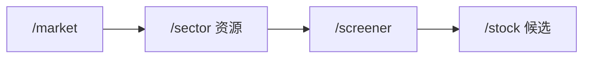

# 视觉专家（visual_expert）· 审查视角档案

> 本文件沉淀"视觉专家"审查视角的方法论，用于在 README、SKILL.md、终端输出、HTML 录入页、演示文档等"用户可视物"上线前做一次"30 秒能否一眼看懂 + 视觉是否舒服"的把关。
>
> 与 [user_expert.md](./user_expert.md) 的关系：用户专家决定"用户愿不愿 + 会不会"，视觉专家决定"用户看着累不累 + 记住什么"。两份文档串联使用，用户专家 ✅ 后再过视觉专家。
>
> 状态：active（v2.2.0 起沉淀为独立审查方法论）
>
> 数据单位：审查结果用 ✅/⚠️/❌ 三态，呈现指标以 px / 字符数 / 对比度计。

---

## 一、核心哲学

视觉专家的本质是**在不动功能的前提下，让信息密度、视觉层级、扫描路径三者协同，使读者 30 秒内找到自己关心的那个数字并记住它**。三条底层假设：

1. **视觉是注意力的过滤器**：用户一眼看不到的东西 = 不存在；不是用户跳走，是文档设计失败。
2. **视觉层即优先级层**：字号、颜色、间距不是装饰，是"先后顺序"的物理化呈现。
3. **视觉服务于信息密度，不替代它**：把 10 行字塞到 1 行只是好看；把 10 行字重组为"标题 + 4 个要点 + 1 张图"才是视觉工作。
4. **风格统一是免费的护城河**：13 个 skill / 28 个 fetcher / 15 份专家人设，统一的视觉语言让用户感到"同一个产品在服务我"，而不是"一堆脚本拼凑"。

## 二、审查清单（可量化）

下表是视觉专家视角的 14 项硬指标，**任何一项 ❌ 即视为 visual-P0 缺陷**，必须修复后再发布。

| 维度       | 检查项                                                                       | 阈值                  | 状态 |
| ---------- | ---------------------------------------------------------------------------- | --------------------- | ---- |
| Hero 三件套 | 首屏 5 行内是否含"一句话定位 + 一个最短路径 + 一个适不适合我的判定"           | 必含                 | ✅/⚠️/❌ |
| 信息密度   | 段落平均长度（中文）不超过 4 行；表格列数不超过 5 列                          | ≤ 4 行 / ≤ 5 列      | ✅/⚠️/❌ |
| 视觉层级   | 同一屏内字号、颜色、加粗不超过 3 级（H1/H2/H3）                              | ≤ 3 层               | ✅/⚠️/❌ |
| 颜色语义   | 🟢/🔴/🟡/⚫ 仅用于语义（买入/回避/观望/中性），不与"装饰色"混用              | 必达                  | ✅/⚠️/❌ |
| Emoji 节制 | 单段 emoji ≤ 3 个；emoji 不替代关键动词（"✅ 通过"不算文字）                 | ≤ 3 / 段             | ✅/⚠️/❌ |
| 表格胜于列表 | 同质信息（> 3 行）优先表格，避免连续编号列表堆砌                              | > 3 行用表格          | ✅/⚠️/❌ |
| 流程图覆盖 | ≥ 3 步的流程（如"选股 → 验证 → 入场"）必须配 mermaid/文字图                 | ≥ 3 步必配           | ✅/⚠️/❌ |
| 折叠段用法 | 重复/低频内容放 `<details>`，主信息全展开                                     | 高频 ≥ 90% 展开      | ✅/⚠️/❌ |
| 代码块完整性 | 演示代码"复制即跑"，不含占位符、`<...>`、`待补`                              | 必达                  | ✅/⚠️/❌ |
| 链接文案   | 链接文字描述目的地（"用户指南"而不是"点这里"）                              | 必达                  | ✅/⚠️/❌ |
| 对比度     | 终端输出色对比度 ≥ 4.5:1（WCAG AA 大字），浅/深底色都测                     | ≥ 4.5:1              | ✅/⚠️/❌ |
| 等宽对齐   | ASCII 表格 / 终端输出框用等宽字符绘制，确保 monospace 渲染整齐               | 必达                  | ✅/⚠️/❌ |
| 图标一致性 | 同类对象用同一类图标（如所有 skill 链接都用 📦 或全部无图标）                 | 同类同形             | ✅/⚠️/❌ |
| 标题导航   | 多段文档含目录（TOC）+ 5 个以上 H2 时，第一屏自动显示锚点                    | ≥ 5 个 H2 必配       | ✅/⚠️/❌ |

> **联动工具**：[`scripts/common/formatters.py`](../scripts/common/formatters.py)（统一输出模板首尾两行）+ 演示 GIF（[docs/assets/](./assets/)）共同保证 visual-P0 在工程层面落地。

## 三、优化原则（可执行）

对照清单 ✅ 后，按以下原则做"加分项"，把视觉从"能看"推到"好看 + 舒服"。

### 3.1 视觉三级层（字号 + 颜色 + 间距）

**只允许 3 级视觉层级**：

| 层级 | 字号（README） | 用途                            | Markdown 语法        |
| ---- | -------------- | ------------------------------- | -------------------- |
| L1   | 28-32 px       | Hero / 段落标题（"## 这是什么"） | `##`                 |
| L2   | 22-26 px       | 子段标题（"### 5 分钟上手"）    | `###`                |
| L3   | 16-18 px       | 正文 / 表格 / 列表              | 段落 / 表格 / 列表   |

正文段落之间间距 1.5em，表格 row 之间间距 1em。**禁止把 H1 嵌进段落**——H1/H2/H3 是结构锚点，不是排版工具。

### 3.2 颜色语义 4 象限

任何颜色都必须"配语义"，让用户一秒钟读懂：

| 颜色 | 语义          | 典型场景                          |
| ---- | ------------- | --------------------------------- |
| 🟢   | 买入 / 健康 / 成功 | expert vote 8.5/10、测例通过、ROE 优 |
| 🟡   | 观望 / 中性   | score 6/10、待补、待评审              |
| 🔴   | 回避 / 失败 / 高风险 | vote 4/10、测例失败、商誉 > 30%   |
| ⚫   | 数据 / 中性事实 | 数字、引用、版本号                   |

禁止把 emoji 当装饰用（"🎉 庆祝我们发布了！"）—— 与"🟢 买入信号"混用会拉低信号价值。

### 3.3 表格 vs 列表的边界

| 场景                              | 用表格                          | 用列表                       |
| --------------------------------- | ------------------------------- | ---------------------------- |
| 同质信息 ≥ 3 行                    | ✅ 表（如"6 个 fetcher 参数"）  | ❌                           |
| 异质信息 / 故事性流程              | ❌                              | ✅ 列表（如"为什么这个决定"） |
| 需要排序 / 对比                    | ✅ 表（按数值排）               | ❌                           |
| 段落太长想"呼吸一下"               | ❌                              | ✅ 列表                       |
| 含"if X then Y"分支               | ❌ 表格不擅长                   | ✅ 列表或 mermaid             |

判断口诀：**信息能压成行列 = 表格；不能压成行列 = 列表**。

### 3.4 mermaid 流程图规范

涉及 ≥ 3 步的流程必须配 mermaid `flowchart`，避免连珠箭：



5 条规范：

1. **节点用 `["...文本..."]`**（带引号的矩形），避免特殊字符导致渲染异常。
2. **箭头方向必须统一 LR 或 TD**（同一图内不混用）。
3. **节点数 ≤ 10**——超过就拆成多张图。
4. **每个节点对应真实 skill / 命令**，不写"步骤 1"。
5. **流程图 caption 含"适合/产出"两行说明**（见 README §"4 个典型场景"）。

### 3.5 演示代码的"复制即跑"原则

任何出现在用户面文档中的代码块，必须满足：

- 无 `<...>`、`{your_code}`、`（占位）` 等占位符。
- 命令真实存在（`/stock sh600519 quick` 比 `/stock <code> <mode>` 优）。
- 配真实输出示例（项目放在 `docs/assets/*.gif`，文本放在代码块后的 ` ```text ` 段）。

## 四、边界与陷阱

### 4.1 视觉专家**不**做的事

- ❌ 不改功能逻辑（只调整呈现）
- ❌ 不引入图片 / 图标三方依赖（项目硬约束"零运行时三方"，所有图都是 ASCII / mermaid / GIF 本地）
- ❌ 不擅自增加视觉模板（每个新模板都会成为"第三个口子"——让"前两个"也难维护）
- ❌ 不做重前端（[implementation-plan §"不做清单"](./implementation-plan-2026-q3-q4.md#不做清单防止范围蔓延) 第 4 条："不重写前端"）

### 4.2 视觉专家**最容易踩**的坑

| 陷阱                        | 表现                                                        | 缓解                                                              |
| --------------------------- | ----------------------------------------------------------- | ----------------------------------------------------------------- |
| **表格列爆炸**              | 7-9 列宽屏表格，手机端读成竖排碎片                          | 列数 ≤ 5；超出分两表或拆字段分组                                  |
| **代码块溢出**              | 100 字符一行在手机上看不全                                  | 黑底线 80 字符，关键内容提到代码块外                              |
| **emoji 滥用**              | 每行前缀 emoji，"🌟 🚀 ✅ 📌 📎 🏆"                         | 单段 ≤ 3 个；同段同时最多 1 种语义色                              |
| **假对比表**                | 用 ASCII 表格但列对不齐，等宽环境看着乱                     | 优先用 Markdown 表格；ASCII 表只在代码块内使用                    |
| **暗黑模式"被打死"**        | 黑色文本配深灰底，看不清                                    | 配色对深底色和浅底色各测一组；用语义色（🟢 🟡 🔴）替代具体 RGB   |
| **流程图节点爆栈**          | 一张 mermaid 塞 15 个节点，箭头交叉成麻团                  | 单图 ≤ 10 节点；超出按"决策分支"分层画                           |
| **GIF / 截图过期**          | README GIF 演示 v1.5，但代码已是 v1.8                       | demo 脚本入仓（`scripts/demo.sh`）+ 文档明标"对应版本"            |
| **表格语义错位**            | 数值列用左对齐，文字列用居中（对不齐）                      | Markdown 表渲染走主题默认（左列左对齐、数字右对齐）               |
| **标题与正文同字号**        | L1 和正文字号一致，导航毫无作用                             | 严格 3 级字号层级（H1 32 / H2 24 / H3 18）                        |

## 五、A 股终端输出的视觉语言

终端字符界面的视觉设计与 Markdown / Web 不一样，需要单独列：

| 维度       | 规范                                                                       | 反例                          |
| ---------- | -------------------------------------------------------------------------- | ----------------------------- |
| 边框字符   | 统一用 `─`（U+2500）/`═`（U+2550）/`·`/`│`，不用 `─` + `-` + `―` 混合     | 同一段有 3 种分隔符           |
| 颜色       | 终端输出区分 4 象限（🟢 🟡 🔴 ⚫），但 emoji 在 terminal 不可靠时降级用代码 | 终端打不出 emoji 但仍依赖    |
| 对齐       | `:<左` / `:>` / `:` 用于列对齐                                            | 数字没右对齐，看着不齐       |
| 行宽       | 终端输出 ≤ 90 字符（80 列宽屏 + 边距）                                     | 长行在窄终端被换行错位       |
| 标点       | 优先用半角 `,.;:` ，标点不空格                                             | 中文逗号/全角数字配半角空格   |
| 数字格式   | 千分位逗号（`1,650`），百分号空格后接（`+18%`），货币符号前缀（`¥1,652`） | 数字无单位（"现价 1,652"）  |

> 详细首尾两行模板见 [methodology.md §四 输出模板](../methodology.md)。

## 六、代表场景（v2.2.0 案例）

| 场景                  | 视角作用            | 优化前                                     | 优化后                                                          |
| --------------------- | ------------------- | ------------------------------------------ | --------------------------------------------------------------- |
| README 全面重构（v1.3.3）| 信息密度 -58%，眼一眼可懂 | 20638 bytes，5 屏首屏，结构松散         | ~8700 bytes，Hero 三件套 + 5 min path + 4 场景 + 13 skill 速查表 |
| 13 个 Skill 速查表（v1.3.3）| 类别分组 + emoji icon | 13 个平铺链接                          | 7 大类分组（决策/环境/选股/组合/技术/验证/研究/学习/辅助）     |
| 5 个 mermaid 流程图（v1.5+）| 场景流程可视化  | 文字"先 X 再 Y"                          | 每个典型场景一张 flowchart LR 图                                |
| 终端输出首尾两行（v1.8.0）| 一眼抓住结论 + 数据源| 5 屏长文                             | 首行结论 + 尾行数据源 + 时间戳                                  |
| Web 录入页（v1.4.0）| 零依赖 HTML 而非 SPA | 想做 React 重前端                      | stdlib `ThreadingHTTPServer` + 单文件 HTML，< 200 行 JS        |
| `<details>` 折叠（v1.5+）| 主信息全展开，次信息折叠 | 全部平铺再长                          | details/summary 把次要信息折叠                                  |
| Status badge 视觉强调（v1.8.0）| 关键指标在 Hero 显示 | 无徽章                                  | 5 个 badge（version / python / license / deps / skills）    |
| 🌟 视觉强调 stock-debate（v1.3.3）| 招牌功能高亮       | 13 个 skill 平铺                         | `stock-debate` 独立成行 + 🌟 emoji + 加粗 + 加大字号              |

## 七、引用来源

- 项目历史角色定义见 [CHANGELOG.md §"v1.3.3"](../CHANGELOG.md)：「本包最独特的卖点」+「stock-debate 独立成行 + 🌟 视觉强调」
- 三方审查背景见 [docs/implementation-plan-2026-q3-q4.md §"概览"](./implementation-plan-2026-q3-q4.md#概览)
- 视觉与用户双视角串联使用见 [docs/user_expert.md](./user_expert.md)
- 输出模板首尾两行见 [methodology.md §四](../methodology.md)
- 不重写前端约束见 [docs/implementation-plan-2026-q3-q4.md §"不做清单"](./implementation-plan-2026-q3-q4.md#不做清单防止范围蔓延)
- WCAG 对比度标准见 [W3C WCAG 2.1 §1.4.3](https://www.w3.org/WAI/WCAG21/Understanding/contrast-minimum.html)

---

> **快速使用本视角**：审查任何用户可视物时，依次回答 §二 清单的 14 个问题；任何 ❌ 项打回修改，⚠️ 项记录到 sprint 任务池。用户专家 + 视觉专家通过后，再交给 code review / 风控专家。
